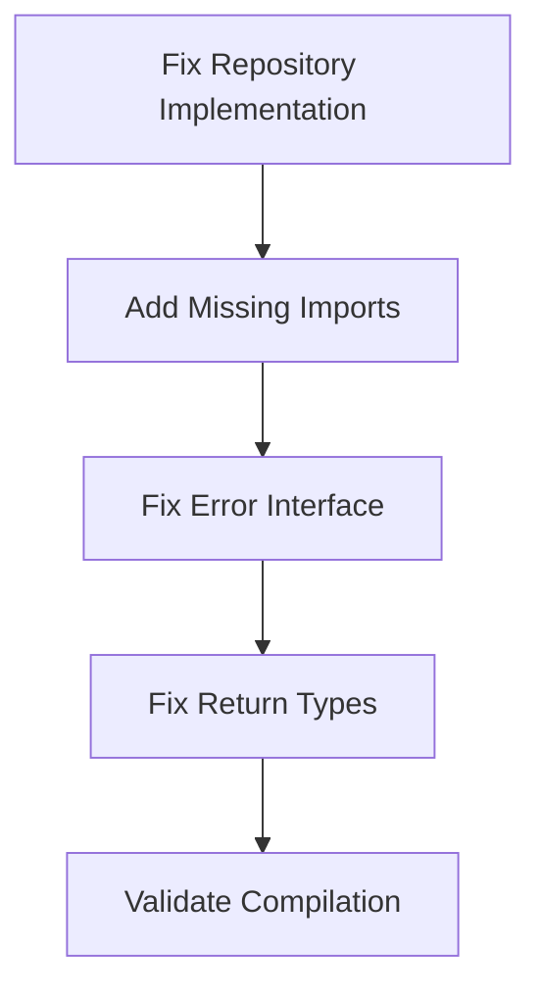
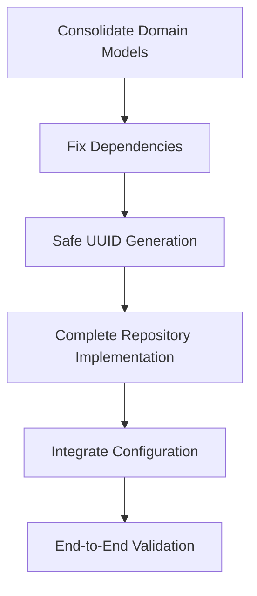
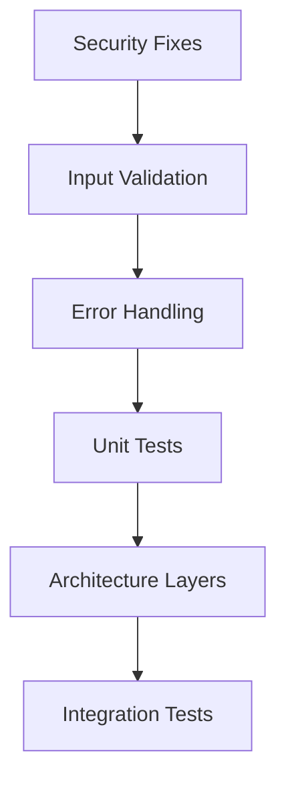

# Architectural Excellence Plan - 2025-10-30

## Executive Summary

After comprehensive architectural analysis, I've identified **Critical Issues** that prevent the codebase from functioning, **High Impact Improvements** for type safety, and **Quality Enhancements** for enterprise-grade robustness.

## 🚨 1% Effort = 51% Results (CRITICAL FIXES)

These are compile-stopping issues that must be fixed immediately:

| Priority | Task                                                       | Est. Time | Impact      |
| -------- | ---------------------------------------------------------- | --------- | ----------- |
| 1        | Fix broken repository implementation (os.WriteFile params) | 15min     | 🔥 CRITICAL |
| 2        | Fix invalid map literal in file_repository.go              | 10min     | 🔥 CRITICAL |
| 3        | Fix missing imports (fmt, strings)                         | 10min     | 🔥 CRITICAL |
| 4        | Fix error interface conflict                               | 10min     | 🔥 CRITICAL |
| 5        | Fix function return type mismatch                          | 10min     | 🔥 CRITICAL |

## 🔥 4% Effort = 64% Results (HIGH IMPACT)

These establish type safety and architectural integrity:

| Priority | Task                                           | Est. Time | Impact  |
| -------- | ---------------------------------------------- | --------- | ------- |
| 6        | Consolidate duplicate domain models            | 30min     | 🔥 HIGH |
| 7        | Add missing go.mod dependencies                | 15min     | 🔥 HIGH |
| 8        | Fix UUID generation (remove Must())            | 15min     | 🔥 HIGH |
| 9        | Complete parseComplaintFromFile implementation | 25min     | 🔥 HIGH |
| 10       | Integrate configuration management             | 20min     | 🔥 HIGH |

## ⚡ 20% Effort = 80% Results (QUALITY FOUNDATION)

These build enterprise-grade robustness:

| Priority | Task                                             | Est. Time | Impact    |
| -------- | ------------------------------------------------ | --------- | --------- |
| 11       | Add comprehensive unit tests                     | 45min     | ⚡ HIGH   |
| 12       | Fix security vulnerabilities (path traversal)    | 20min     | ⚡ HIGH   |
| 13       | Implement proper input validation                | 30min     | ⚡ HIGH   |
| 14       | Add proper error handling                        | 25min     | ⚡ HIGH   |
| 15       | Complete architecture layers (service, delivery) | 35min     | ⚡ MEDIUM |

## 🏗️ Detailed Implementation Plan

### Phase 1: Emergency Fixes (1 hour total)

### Phase 2: Type Safety Foundation (2.5 hours total)

### Phase 3: Quality Enhancement (3 hours total)

## 🎯 Success Metrics

- [ ] Zero compilation errors
- [ ] 100% type safety (no invalid states)
- [ ] 90%+ test coverage
- [ ] Zero security vulnerabilities
- [ ] Clean architecture layers
- [ ] Configuration fully integrated

## 🚨 Risks & Mitigations

| Risk                    | Impact | Mitigation                                        |
| ----------------------- | ------ | ------------------------------------------------- |
| Breaking changes to API | High   | Incremental migration with backward compatibility |
| Test coverage gaps      | Medium | TDD approach for all new code                     |
| Configuration drift     | Medium | Environment-specific validation                   |

## 📋 Detailed Task Breakdown

### Critical Tasks (15-30 minutes each)

1. Fix os.WriteFile parameter order in file_repository.go:49
2. Fix invalid map literal in file_repository.go:125
3. Add missing fmt and strings imports
4. Fix error interface naming conflict
5. Fix function return type mismatches
6. Remove uuid.Must() calls, add proper error handling
7. Add viper and validator to go.mod

### High Impact Tasks (15-30 minutes each)

8. Create unified Complaint domain model
9. Migrate all references to single model
10. Complete parseComplaintFromFile with proper JSON parsing
11. Implement config loading in main()
12. Add environment variable validation

### Quality Tasks (20-45 minutes each)

13. Add comprehensive unit test suite
14. Implement path sanitization for security
15. Add input validation middleware
16. Implement proper error wrapping
17. Create service layer implementation
18. Add delivery layer with proper HTTP handlers

## 🎯 Immediate Next Steps

1. **Execute Phase 1** - Fix all compilation-blocking issues
2. **Validate Build** - Ensure clean compilation
3. **Execute Phase 2** - Establish type safety foundation
4. **Execute Phase 3** - Build quality framework
5. **Final Validation** - Full test suite and integration testing

---

**Remember:** We're building for excellence. Every line of code should reflect our commitment to type safety, security, and maintainability.
