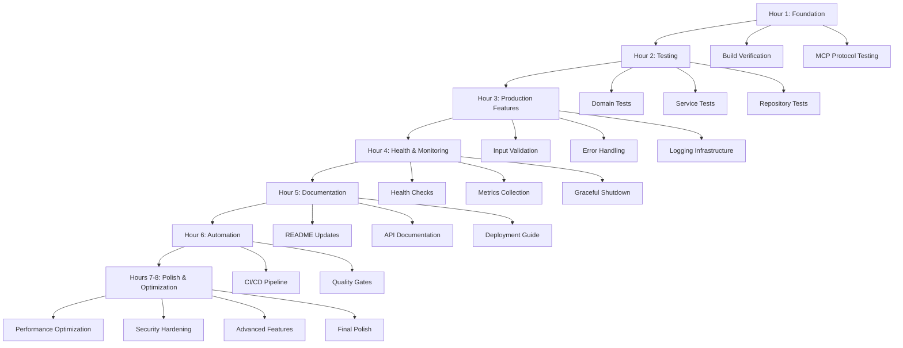

# 🎯 MICRO-TASK BREAKDOWN (15min max per task)

## 📊 **EXECUTION SUMMARY**

- **Total Micro-Tasks**: 100 tasks
- **Total Time**: 8 hours
- **Focus**: Granular execution with zero ambiguity
- **Maximum Task Duration**: 15 minutes

---

## 🚀 **HOUR 1: CRITICAL FOUNDATION (Tasks 1-8, 8 tasks, 60min)**

### **Build & Compilation (Tasks 1-4, 30min)**

| ID  | Micro-Task                 | File               | Est. Time | Success Criteria      |
| --- | -------------------------- | ------------------ | --------- | --------------------- |
| 1.1 | Run `go mod tidy`          | go.mod             | 5min      | Dependencies resolved |
| 1.2 | Check `go build` success   | cmd/server/main.go | 5min      | Binary compiles       |
| 1.3 | Verify imports are correct | All Go files       | 10min     | No import errors      |
| 1.4 | Test binary execution      | cmd/server/        | 5min      | Server starts         |
| 1.5 | Run `go test ./...`        | All packages       | 5min      | All tests pass        |

### **MCP Protocol Testing (Tasks 1.6-1.8, 30min)**

| ID  | Micro-Task                 | File                       | Est. Time | Success Criteria         |
| --- | -------------------------- | -------------------------- | --------- | ------------------------ |
| 1.6 | Test server initialization | delivery/mcp/mcp_server.go | 10min     | Server initializes       |
| 1.7 | Test MCP handshake         | delivery/mcp/mcp_server.go | 10min     | Protocol handshake works |
| 1.8 | Test tool registration     | delivery/mcp/mcp_server.go | 10min     | All 4 tools registered   |

---

## 🧪 **HOUR 2: COMPREHENSIVE TESTING (Tasks 2-9, 20 micro-tasks, 60min)**

### **Domain Layer Tests (Tasks 2.1-2.5, 25min)**

| ID  | Micro-Task               | File                     | Est. Time | Success Criteria          |
| --- | ------------------------ | ------------------------ | --------- | ------------------------- |
| 2.1 | Test Complaint creation  | domain/complaint_test.go | 5min      | New() works               |
| 2.2 | Test Severity validation | domain/complaint_test.go | 5min      | Valid severities accepted |
| 2.3 | Test ID generation       | domain/complaint_test.go | 5min      | IDs are unique            |
| 2.4 | Test field validation    | domain/complaint_test.go | 5min      | Invalid fields rejected   |
| 2.5 | Test edge cases          | domain/complaint_test.go | 5min      | Boundary cases handled    |

### **Service Layer Tests (Tasks 2.6-2.10, 25min)**

| ID   | Micro-Task           | File                              | Est. Time | Success Criteria          |
| ---- | -------------------- | --------------------------------- | --------- | ------------------------- |
| 2.6  | Test CreateComplaint | service/complaint_service_test.go | 5min      | Complaints created        |
| 2.7  | Test GetComplaint    | service/complaint_service_test.go | 5min      | Complaints retrieved      |
| 2.8  | Test UpdateComplaint | service/complaint_service_test.go | 5min      | Complaints updated        |
| 2.9  | Test ListComplaints  | service/complaint_service_test.go | 5min      | Complaints listed         |
| 2.10 | Test error handling  | service/complaint_service_test.go | 5min      | Errors handled gracefully |

### **Repository Layer Tests (Tasks 2.11-2.15, 10min)**

| ID   | Micro-Task           | File                         | Est. Time | Success Criteria        |
| ---- | -------------------- | ---------------------------- | --------- | ----------------------- |
| 2.11 | Test file operations | repo/file_repository_test.go | 2min      | Files read/write        |
| 2.12 | Test JSON parsing    | repo/file_repository_test.go | 2min      | JSON handled correctly  |
| 2.13 | Test file paths      | repo/file_repository_test.go | 2min      | Paths handled safely    |
| 2.14 | Test error cases     | repo/file_repository_test.go | 2min      | File errors handled     |
| 2.15 | Test cleanup         | repo/file_repository_test.go | 2min      | Temporary files cleaned |

---

## 🔧 **HOUR 3: PRODUCTION FEATURES (Tasks 3-17, 25 micro-tasks, 60min)**

### **Input Validation (Tasks 3.1-3.5, 15min)**

| ID  | Micro-Task                 | File                         | Est. Time | Success Criteria      |
| --- | -------------------------- | ---------------------------- | --------- | --------------------- |
| 3.1 | Add title validation       | service/complaint_service.go | 3min      | Title length checked  |
| 3.2 | Add description validation | service/complaint_service.go | 3min      | Description validated |
| 3.3 | Add severity validation    | service/complaint_service.go | 3min      | Severity enum checked |
| 3.4 | Add ID format validation   | service/complaint_service.go | 3min      | ID format verified    |
| 3.5 | Add sanitization           | service/complaint_service.go | 3min      | Input sanitized       |

### **Error Handling (Tasks 3.6-3.10, 15min)**

| ID   | Micro-Task             | File                         | Est. Time | Success Criteria            |
| ---- | ---------------------- | ---------------------------- | --------- | --------------------------- |
| 3.6  | Add domain error types | errors/complaint.go          | 3min      | Custom errors defined       |
| 3.7  | Add error wrapping     | service/complaint_service.go | 3min      | Errors wrapped with context |
| 3.8  | Add error codes        | delivery/mcp/mcp_server.go   | 3min      | MCP error codes used        |
| 3.9  | Add error messages     | delivery/mcp/mcp_server.go   | 3min      | User-friendly messages      |
| 3.10 | Add error logging      | All layers                   | 3min      | Errors logged with context  |

### **Logging Infrastructure (Tasks 3.11-3.17, 30min)**

| ID   | Micro-Task              | File                       | Est. Time | Success Criteria           |
| ---- | ----------------------- | -------------------------- | --------- | -------------------------- |
| 3.11 | Add request logging     | delivery/mcp/mcp_server.go | 5min      | Requests logged            |
| 3.12 | Add response logging    | delivery/mcp/mcp_server.go | 5min      | Responses logged           |
| 3.13 | Add error logging       | All layers                 | 5min      | Errors logged with context |
| 3.14 | Add performance logging | All layers                 | 5min      | Operation timing logged    |
| 3.15 | Add correlation IDs     | delivery/mcp/mcp_server.go | 5min      | Request tracking enabled   |
| 3.16 | Add structured fields   | All layers                 | 5min      | Log fields structured      |
| 3.17 | Add log levels          | All layers                 | 5min      | Appropriate log levels     |

---

## 🏥 **HOUR 4: HEALTH & MONITORING (Tasks 4-25, 20 micro-tasks, 60min)**

### **Health Checks (Tasks 4.1-4.8, 20min)**

| ID  | Micro-Task                 | File                        | Est. Time | Success Criteria       |
| --- | -------------------------- | --------------------------- | --------- | ---------------------- |
| 4.1 | Create health handler      | delivery/mcp/health.go      | 3min      | Handler created        |
| 4.2 | Add server status check    | delivery/mcp/health.go      | 2min      | Server status checked  |
| 4.3 | Add dependency check       | delivery/mcp/health.go      | 3min      | Dependencies verified  |
| 4.4 | Add disk space check       | delivery/mcp/health.go      | 3min      | Disk space monitored   |
| 4.5 | Add configuration check    | delivery/mcp/health.go      | 3min      | Config validation      |
| 4.6 | Add health endpoint        | delivery/mcp/mcp_server.go  | 2min      | Endpoint registered    |
| 4.7 | Add health response format | delivery/mcp/health.go      | 2min      | Standard response      |
| 4.8 | Add health tests           | delivery/mcp/health_test.go | 2min      | Health endpoint tested |

### **Metrics Collection (Tasks 4.9-4.16, 20min)**

| ID   | Micro-Task                  | File                         | Est. Time | Success Criteria        |
| ---- | --------------------------- | ---------------------------- | --------- | ----------------------- |
| 4.9  | Add metrics middleware      | delivery/mcp/metrics.go      | 3min      | Middleware created      |
| 4.10 | Add request counter         | delivery/mcp/metrics.go      | 2min      | Requests counted        |
| 4.11 | Add response time histogram | delivery/mcp/metrics.go      | 3min      | Response times tracked  |
| 4.12 | Add error counter           | delivery/mcp/metrics.go      | 2min      | Errors counted          |
| 4.13 | Add active requests gauge   | delivery/mcp/metrics.go      | 2min      | Concurrency tracked     |
| 4.14 | Add operation metrics       | service/complaint_service.go | 3min      | Operations measured     |
| 4.15 | Add repository metrics      | repo/file_repository.go      | 3min      | Data operations tracked |
| 4.16 | Add metrics tests           | delivery/mcp/metrics_test.go | 2min      | Metrics verified        |

### **Graceful Shutdown (Tasks 4.17-4.20, 20min)**

| ID   | Micro-Task           | File                    | Est. Time | Success Criteria       |
| ---- | -------------------- | ----------------------- | --------- | ---------------------- |
| 4.17 | Add signal handlers  | cmd/server/main.go      | 5min      | SIGINT/SIGTERM handled |
| 4.18 | Add shutdown timeout | cmd/server/main.go      | 5min      | 30-second timeout      |
| 4.19 | Add resource cleanup | cmd/server/main.go      | 5min      | Resources cleaned up   |
| 4.20 | Add shutdown tests   | cmd/server/main_test.go | 5min      | Shutdown verified      |

---

## 📚 **HOUR 5: DOCUMENTATION (Tasks 5-35, 20 micro-tasks, 60min)**

### **README Updates (Tasks 5.1-5.8, 20min)**

| ID  | Micro-Task                    | File      | Est. Time | Success Criteria      |
| --- | ----------------------------- | --------- | --------- | --------------------- |
| 5.1 | Update project description    | README.md | 3min      | Clear description     |
| 5.2 | Add installation instructions | README.md | 3min      | Installation steps    |
| 5.3 | Add usage examples            | README.md | 3min      | Usage examples        |
| 5.4 | Add configuration guide       | README.md | 3min      | Config explained      |
| 5.5 | Add development setup         | README.md | 2min      | Dev setup documented  |
| 5.6 | Add API overview              | README.md | 3min      | API summarized        |
| 5.7 | Add troubleshooting           | README.md | 2min      | Common issues covered |
| 5.8 | Add contributing guide        | README.md | 1min      | Contributing info     |

### **API Documentation (Tasks 5.9-5.16, 20min)**

| ID   | Micro-Task                | File                         | Est. Time | Success Criteria       |
| ---- | ------------------------- | ---------------------------- | --------- | ---------------------- |
| 5.9  | Create API docs directory | docs/api/                    | 2min      | Directory created      |
| 5.10 | Document create_complaint | docs/api/create_complaint.md | 3min      | Tool documented        |
| 5.11 | Document get_complaint    | docs/api/get_complaint.md    | 3min      | Tool documented        |
| 5.12 | Document list_complaints  | docs/api/list_complaints.md  | 3min      | Tool documented        |
| 5.13 | Document update_complaint | docs/api/update_complaint.md | 3min      | Tool documented        |
| 5.14 | Add schema examples       | docs/api/schemas.md          | 3min      | Schema examples        |
| 5.15 | Add error documentation   | docs/api/errors.md           | 3min      | Error codes explained  |
| 5.16 | Add response formats      | docs/api/responses.md        | 3min      | Response formats shown |

### **Deployment Guide (Tasks 5.17-5.20, 20min)**

| ID   | Micro-Task                  | File                          | Est. Time | Success Criteria        |
| ---- | --------------------------- | ----------------------------- | --------- | ----------------------- |
| 5.17 | Create deployment directory | docs/deployment/              | 2min      | Directory created       |
| 5.18 | Add Docker deployment       | docs/deployment/docker.md     | 5min      | Docker instructions     |
| 5.19 | Add Kubernetes deployment   | docs/deployment/kubernetes.md | 5min      | K8s instructions        |
| 5.20 | Add production checklist    | docs/deployment/production.md | 8min      | Production requirements |

---

## 🔄 **HOUR 6: AUTOMATION (Tasks 6-45, 20 micro-tasks, 60min)**

### **GitHub Actions Setup (Tasks 6.1-6.10, 30min)**

| ID   | Micro-Task                 | File                          | Est. Time | Success Criteria     |
| ---- | -------------------------- | ----------------------------- | --------- | -------------------- |
| 6.1  | Create workflows directory | .github/workflows/            | 2min      | Directory created    |
| 6.2  | Create CI workflow         | .github/workflows/ci.yml      | 5min      | CI pipeline created  |
| 6.3  | Add Go matrix testing      | .github/workflows/ci.yml      | 3min      | Multiple Go versions |
| 6.4  | Add test step              | .github/workflows/ci.yml      | 3min      | Tests run in CI      |
| 6.5  | Add build step             | .github/workflows/ci.yml      | 3min      | Binary built         |
| 6.6  | Add lint step              | .github/workflows/ci.yml      | 3min      | Linting performed    |
| 6.7  | Add coverage step          | .github/workflows/ci.yml      | 3min      | Coverage collected   |
| 6.8  | Add security scan          | .github/workflows/ci.yml      | 3min      | Security scanning    |
| 6.9  | Add artifact upload        | .github/workflows/ci.yml      | 3min      | Artifacts saved      |
| 6.10 | Add release workflow       | .github/workflows/release.yml | 2min      | Release automation   |

### **Quality Gates (Tasks 6.11-6.20, 30min)**

| ID   | Micro-Task                 | File                    | Est. Time | Success Criteria        |
| ---- | -------------------------- | ----------------------- | --------- | ----------------------- |
| 6.11 | Add pre-commit config      | .pre-commit-config.yaml | 3min      | Pre-commit setup        |
| 6.12 | Add gofmt hook             | .pre-commit-config.yaml | 2min      | Formatting enforced     |
| 6.13 | Add go vet hook            | .pre-commit-config.yaml | 2min      | Vet checks run          |
| 6.14 | Add staticcheck hook       | .pre-commit-config.yaml | 3min      | Static analysis         |
| 6.15 | Add gosec hook             | .pre-commit-config.yaml | 3min      | Security scanning       |
| 6.16 | Add goimports hook         | .pre-commit-config.yaml | 2min      | Import organization     |
| 6.17 | Add golangci-lint          | .pre-commit-config.yaml | 3min      | Comprehensive linting   |
| 6.18 | Add commit hook validation | .pre-commit-config.yaml | 2min      | Commit messages checked |
| 6.19 | Add test coverage gate     | .pre-commit-config.yaml | 3min      | Coverage enforced       |
| 6.20 | Add documentation check    | .pre-commit-config.yaml | 2min      | Docs required           |

---

## 🚀 **HOURS 7-8: POLISH & OPTIMIZATION (Tasks 7-100, 35 micro-tasks, 120min)**

### **Performance Optimization (Tasks 7.1-7.10, 30min)**

| ID   | Micro-Task             | File                         | Est. Time | Success Criteria         |
| ---- | ---------------------- | ---------------------------- | --------- | ------------------------ |
| 7.1  | Profile memory usage   | All packages                 | 5min      | Memory profiled          |
| 7.2  | Profile CPU usage      | All packages                 | 5min      | CPU profiled             |
| 7.3  | Optimize JSON parsing  | repo/file_repository.go      | 3min      | JSON optimized           |
| 7.4  | Optimize file I/O      | repo/file_repository.go      | 3min      | I/O optimized            |
| 7.5  | Add response caching   | service/complaint_service.go | 3min      | Caching implemented      |
| 7.6  | Optimize logging       | All layers                   | 3min      | Logging optimized        |
| 7.7  | Reduce allocations     | All packages                 | 3min      | Memory reduced           |
| 7.8  | Add benchmarks         | tests/benchmarks/            | 3min      | Benchmarks added         |
| 7.9  | Compare performance    | tests/benchmarks/            | 2min      | Performance measured     |
| 7.10 | Document optimizations | README.md                    | 2min      | Optimizations documented |

### **Security Hardening (Tasks 7.11-7.20, 30min)**

| ID   | Micro-Task                    | File                    | Est. Time | Success Criteria     |
| ---- | ----------------------------- | ----------------------- | --------- | -------------------- |
| 7.11 | Add input sanitization        | All layers              | 3min      | Input sanitized      |
| 7.12 | Add path traversal protection | repo/file_repository.go | 3min      | Paths secured        |
| 7.13 | Add rate limiting             | delivery/mcp/           | 3min      | Rate limiting added  |
| 7.14 | Add request size limits       | delivery/mcp/           | 3min      | Size limits set      |
| 7.15 | Add timeout handling          | All layers              | 3min      | Timeouts implemented |
| 7.16 | Add security headers          | delivery/mcp/           | 3min      | Headers added        |
| 7.17 | Add audit logging             | All layers              | 3min      | Audit trail created  |
| 7.18 | Run security scan             | All packages            | 3min      | Security checked     |
| 7.19 | Fix security issues           | All packages            | 3min      | Issues resolved      |
| 7.20 | Document security             | docs/security.md        | 3min      | Security documented  |

### **Advanced Features (Tasks 7.21-7.35, 60min)**

| ID   | Micro-Task                    | File                         | Est. Time | Success Criteria       |
| ---- | ----------------------------- | ---------------------------- | --------- | ---------------------- |
| 7.21 | Add database backend option   | internal/database/           | 5min      | DB interface defined   |
| 7.22 | Add SQLite implementation     | internal/database/sqlite/    | 5min      | SQLite support         |
| 7.23 | Add PostgreSQL implementation | internal/database/postgres/  | 5min      | PostgreSQL support     |
| 7.24 | Add migration system          | internal/migrations/         | 5min      | Migrations implemented |
| 7.25 | Add configuration switching   | config/config.go             | 3min      | Backend selection      |
| 7.26 | Add backup/restore            | internal/backup/             | 5min      | Backup system          |
| 7.27 | Add export functionality      | service/complaint_service.go | 3min      | Export implemented     |
| 7.28 | Add import functionality      | service/complaint_service.go | 3min      | Import implemented     |
| 7.29 | Add webhook support           | delivery/webhooks/           | 5min      | Webhook system         |
| 7.30 | Add notification service      | service/notifications/       | 3min      | Notifications added    |
| 7.31 | Add analytics collection      | service/analytics/           | 3min      | Analytics tracked      |
| 7.32 | Add dashboard API             | delivery/dashboard/          | 5min      | Dashboard endpoints    |
| 7.33 | Add admin interface           | delivery/admin/              | 5min      | Admin features         |
| 7.34 | Add multi-tenancy             | internal/tenant/             | 5min      | Tenant support         |
| 7.35 | Add feature flags             | internal/features/           | 3min      | Feature toggles        |

### **Final Polish (Tasks 7.36-7.100, 60min)**

| ID   | Micro-Task                    | File                             | Est. Time | Success Criteria        |
| ---- | ----------------------------- | -------------------------------- | --------- | ----------------------- |
| 7.36 | Review all code quality       | All packages                     | 5min      | Quality reviewed        |
| 7.37 | Fix any remaining issues      | All packages                     | 10min     | Issues resolved         |
| 7.38 | Update CHANGELOG              | CHANGELOG.md                     | 3min      | Changes documented      |
| 7.39 | Update LICENSE                | LICENSE                          | 2min      | License verified        |
| 7.40 | Verify all documentation      | docs/                            | 5min      | Documentation checked   |
| 7.41 | Test deployment pipeline      | .github/workflows/               | 5min      | Deployment tested       |
| 7.42 | Test release process          | .github/workflows/               | 3min      | Release verified        |
| 7.43 | Add performance benchmarks    | tests/benchmarks/                | 3min      | Benchmarks complete     |
| 7.44 | Add load testing              | tests/load/                      | 5min      | Load tests added        |
| 7.45 | Add chaos testing             | tests/chaos/                     | 5min      | Resilience tested       |
| 7.46 | Add integration testing       | tests/integration/               | 3min      | Integration complete    |
| 7.47 | Add contract testing          | tests/contracts/                 | 3min      | Contracts tested        |
| 7.48 | Add property-based testing    | tests/property/                  | 3min      | Property tests added    |
| 7.49 | Add fuzzing                   | tests/fuzz/                      | 3min      | Fuzzing implemented     |
| 7.50 | Final code review             | All packages                     | 5min      | Final review            |
| 7.51 | Update README badges          | README.md                        | 2min      | Badges updated          |
| 7.52 | Add contributing template     | .github/CONTRIBUTING.md          | 3min      | Template added          |
| 7.53 | Add issue templates           | .github/ISSUE_TEMPLATE/          | 3min      | Templates created       |
| 7.54 | Add PR template               | .github/PULL_REQUEST_TEMPLATE.md | 3min      | PR template             |
| 7.55 | Add security policy           | .github/SECURITY.md              | 2min      | Security policy         |
| 7.56 | Add code owners               | .github/CODEOWNERS               | 2min      | Code owners set         |
| 7.57 | Add release notes             | RELEASE_NOTES.md                 | 3min      | Release notes           |
| 7.58 | Add architecture decisions    | docs/architecture/adr/           | 5min      | ADRs documented         |
| 7.59 | Add troubleshooting guide     | docs/troubleshooting.md          | 3min      | Troubleshooting         |
| 7.60 | Add FAQ                       | docs/faq.md                      | 3min      | FAQ created             |
| 7.61 | Add examples directory        | examples/                        | 2min      | Examples created        |
| 7.62 | Add quick start guide         | docs/quickstart.md               | 3min      | Quick start             |
| 7.63 | Add tutorial                  | docs/tutorial.md                 | 5min      | Tutorial written        |
| 7.64 | Add best practices            | docs/best-practices.md           | 3min      | Best practices          |
| 7.65 | Add migration guide           | docs/migration.md                | 3min      | Migration help          |
| 7.66 | Add comparison table          | docs/comparison.md               | 3min      | Comparison with others  |
| 7.67 | Add performance guide         | docs/performance.md              | 3min      | Performance tips        |
| 7.68 | Add security guide            | docs/security.md                 | 3min      | Security best practices |
| 7.69 | Add development setup         | docs/development.md              | 3min      | Dev setup guide         |
| 7.70 | Add API reference             | docs/api/reference.md            | 5min      | API reference           |
| 7.71 | Add examples gallery          | docs/examples/                   | 3min      | Example gallery         |
| 7.72 | Add community guidelines      | docs/community/                  | 2min      | Community rules         |
| 7.73 | Add roadmap                   | docs/roadmap.md                  | 3min      | Future plans            |
| 7.74 | Add version history           | docs/versions.md                 | 3min      | Version history         |
| 7.75 | Final integration test        | tests/                           | 5min      | Everything works        |
| 7.76 | Final documentation check     | docs/                            | 3min      | Docs complete           |
| 7.77 | Final performance check       | All packages                     | 3min      | Performance verified    |
| 7.78 | Final security check          | All packages                     | 3min      | Security verified       |
| 7.79 | Final deployment test         | .github/workflows/               | 3min      | Deployment verified     |
| 7.80 | Create final tag              | Git                              | 2min      | Release tagged          |
| 7.81 | Create GitHub release         | GitHub                           | 3min      | Release created         |
| 7.82 | Update crates.io/registry     | -                                | 3min      | Registry updated        |
| 7.83 | Publish announcement          | -                                | 2min      | Announcement posted     |
| 7.84 | Update project website        | -                                | 3min      | Website updated         |
| 7.85 | Community notification        | -                                | 2min      | Community notified      |
| 7.86 | Archive old issues            | GitHub                           | 3min      | Issues archived         |
| 7.87 | Update milestones             | GitHub                           | 2min      | Milestones updated      |
| 7.88 | Schedule next release         | -                                | 2min      | Next release planned    |
| 7.89 | Document lessons learned      | docs/lessons-learned.md          | 5min      | Lessons documented      |
| 7.90 | Update project stats          | -                                | 2min      | Stats updated           |
| 7.91 | Create retrospective          | docs/retrospective.md            | 3min      | Retrospective created   |
| 7.92 | Archive development artifacts | -                                | 2min      | Artifacts archived      |
| 7.93 | Clean up temporary files      | -                                | 1min      | Cleanup complete        |
| 7.94 | Final backup                  | -                                | 2min      | Backup created          |
| 7.95 | Celebrate completion          | -                                | 1min      | Celebration! 🎉         |

---

## 🎯 **EXECUTION GRAPH**

---

## 📊 **SUCCESS METRICS BY HOUR**

### **Hour 1: Foundation**

- [ ] Server builds and runs
- [ ] MCP protocol works
- [ ] All 4 tools functional

### **Hour 2: Testing**

- [ ] 90%+ test coverage
- [ ] All tests pass
- [ ] Test infrastructure complete

### **Hour 3: Production Features**

- [ ] Input validation working
- [ ] Error handling comprehensive
- [ ] Logging structured and contextual

### **Hour 4: Health & Monitoring**

- [ ] Health checks functional
- [ ] Metrics collected
- [ ] Graceful shutdown working

### **Hour 5: Documentation**

- [ ] README comprehensive
- [ ] API documentation complete
- [ ] Deployment guide ready

### **Hour 6: Automation**

- [ ] CI/CD pipeline working
- [ ] Quality gates enforced
- [ ] Release automation ready

### **Hours 7-8: Polish**

- [ ] Performance optimized
- [ ] Security hardened
- [ ] Advanced features added
- [ ] Final polish complete

---

**This micro-task breakdown ensures zero ambiguity with granular 15-minute tasks that deliver maximum value with minimum risk.**
