# 🎯 PARETO PRINCIPLE EXECUTION PLAN

**Date**: 2025-10-30  
**Focus**: 1% → 51% value, 4% → 64% value, 20% → 80% value

---

## 🎯 **PARETO ANALYSIS RESULTS**

### **🥇 1% EFFORT (15 minutes) DELIVERING 51% VALUE**

**What is the absolute minimum that creates maximum impact?**

| Task                        | Time  | Impact     | Why This is Critical                     |
| --------------------------- | ----- | ---------- | ---------------------------------------- |
| **Verify server builds**    | 5min  | ⭐⭐⭐⭐⭐ | Foundation - nothing works without this  |
| **Test MCP protocol works** | 10min | ⭐⭐⭐⭐⭐ | Core functionality - server must respond |

**Result**: Working MCP server that can be deployed immediately

---

### **🥈 4% EFFORT (60 minutes) DELIVERING 64% VALUE**

**What small changes dramatically improve production readiness?**

| Task                        | Time  | Impact     | Why This Matters             |
| --------------------------- | ----- | ---------- | ---------------------------- |
| **Add basic unit tests**    | 15min | ⭐⭐⭐⭐⭐ | Confidence in implementation |
| **Add input validation**    | 10min | ⭐⭐⭐⭐⭐ | Prevents runtime crashes     |
| **Add error handling**      | 10min | ⭐⭐⭐⭐   | Professional behavior        |
| **Add structured logging**  | 10min | ⭐⭐⭐⭐   | Debugging capability         |
| **Add basic documentation** | 10min | ⭐⭐⭐     | User understanding           |
| **Add health check**        | 5min  | ⭐⭐⭐     | Production monitoring        |

**Result**: Production-ready, maintainable, observable server

---

### **🥉 20% EFFORT (4 hours) DELIVERING 80% VALUE**

**What comprehensive changes create enterprise-grade system?**

| Category                | Tasks                                     | Time  | Impact     |
| ----------------------- | ----------------------------------------- | ----- | ---------- |
| **Testing Suite**       | Unit + Integration + E2E                  | 60min | ⭐⭐⭐⭐⭐ |
| **Production Features** | Health + Metrics + Shutdown               | 45min | ⭐⭐⭐⭐   |
| **Security**            | Validation + Sanitization + Rate limiting | 30min | ⭐⭐⭐⭐   |
| **Documentation**       | README + API + Deployment                 | 30min | ⭐⭐⭐     |
| **CI/CD**               | GitHub Actions workflow                   | 30min | ⭐⭐⭐     |
| **Performance**         | Optimization + Caching                    | 15min | ⭐⭐⭐     |
| **Monitoring**          | Structured logs + Alerting                | 30min | ⭐⭐⭐     |

**Result**: Enterprise-grade, deployment-ready system

---

## 🚀 **EXECUTION GRAPH**

```mermaid
graph TD
    Start([Start: Current State<br/>80% Functional MCP Server]) --> Phase1["🥇 Phase 1: 1% Effort<br/>15 minutes<br/>Deliver 51% Value"]

    Phase1 --> T1["Task 1.1: Verify Build<br/>5min<br/>Foundation"]
    T1 --> T2["Task 1.2: Test MCP Protocol<br/>10min<br/>Core Functionality"]

    T2 --> Phase2["🥈 Phase 2: 4% Effort<br/>60 minutes<br/>Deliver 64% Value"]

    Phase2 --> T3["Task 2.1: Add Unit Tests<br/>15min<br/>Confidence"]
    T3 --> T4["Task 2.2: Input Validation<br/>10min<br/>Safety"]
    T4 --> T5["Task 2.3: Error Handling<br/>10min<br/>Professional"]
    T5 --> T6["Task 2.4: Structured Logging<br/>10min<br/>Debugging"]
    T6 --> T7["Task 2.5: Basic Documentation<br/>10min<br/>Understanding"]
    T7 --> T8["Task 2.6: Health Check<br/>5min<br/>Monitoring"]

    T8 --> Phase3["🥉 Phase 3: 20% Effort<br/>4 hours<br/>Deliver 80% Value"]

    subgraph "Testing Suite (60min)"
        T9["Task 3.1: Unit Tests"]
        T10["Task 3.2: Integration Tests"]
        T11["Task 3.3: E2E Tests"]
    end

    subgraph "Production Features (45min)"
        T12["Task 3.4: Health Checks"]
        T13["Task 3.5: Metrics"]
        T14["Task 3.6: Graceful Shutdown"]
    end

    subgraph "Security (30min)"
        T15["Task 3.7: Validation"]
        T16["Task 3.8: Sanitization"]
        T17["Task 3.9: Rate Limiting"]
    end

    subgraph "Documentation (30min)"
        T18["Task 3.10: README"]
        T19["Task 3.11: API Docs"]
        T20["Task 3.12: Deployment Guide"]
    end

    subgraph "CI/CD (30min)"
        T21["Task 3.13: GitHub Actions"]
        T22["Task 3.14: Quality Gates"]
        T23["Task 3.15: Release Automation"]
    end

    subgraph "Performance (15min)"
        T24["Task 3.16: Optimization"]
        T25["Task 3.17: Caching"]
    end

    subgraph "Monitoring (30min)"
        T26["Task 3.18: Advanced Logging"]
        T27["Task 3.19: Alerting"]
        T28["Task 3.20: Observability"]
    end

    Phase3 --> T9
    T9 --> T10
    T10 --> T11
    T11 --> T12
    T12 --> T13
    T13 --> T14
    T14 --> T15
    T15 --> T16
    T16 --> T17
    T17 --> T18
    T18 --> T19
    T19 --> T20
    T20 --> T21
    T21 --> T22
    T22 --> T23
    T23 --> T24
    T24 --> T25
    T25 --> T26
    T26 --> T27
    T27 --> T28

    T28 --> Success([🎉 SUCCESS:<br/>Enterprise-Grade MCP Server<br/>Production Ready<br/>80% Value Delivered])

    %% Styling
    classDef critical fill:#ff4444,stroke:#333,stroke-width:2px,color:#fff
    classDef high fill:#ff8800,stroke:#333,stroke-width:2px,color:#fff
    classDef medium fill:#ffaa00,stroke:#333,stroke-width:2px,color:#fff
    classDef success fill:#00aa44,stroke:#333,stroke-width:2px,color:#fff

    class Phase1,Phase2,Phase3 critical
    class T1,T2 high
    class T3,T4,T5,T6,T7,T8 medium
    class Success success
```



---

## 📊 **DETAILED BREAKDOWN**

### **🔴 IMMEDIATE ACTIONS (Next 15 minutes)**

**Priority 1: Foundation**

```bash
# 1. Verify build (5 minutes)
go mod tidy
go build -o complaints-mcp ./cmd/server
./complaints-mcp --help

# 2. Test MCP protocol (10 minutes)
./complaints-mcp &
# Test with MCP client
# Verify all 4 tools respond
```

**Expected Result**: Working MCP server

---

### **🟡 HIGH IMPACT ACTIONS (Next 60 minutes)**

**Priority 2: Production Safety**

```bash
# 1. Add unit tests (15 minutes)
# Test domain models
# Test service layer
# Test repository layer

# 2. Add input validation (10 minutes)
# Validate all tool inputs
# Add sanitization
# Test edge cases

# 3. Add error handling (10 minutes)
# Wrap all errors
# Add context
# Test error paths

# 4. Add logging (10 minutes)
# Structured logging
# Correlation IDs
# Request tracing

# 5. Add documentation (10 minutes)
# Update README
# Add usage examples
# Document configuration

# 6. Add health check (5 minutes)
# Health endpoint
# Dependency checks
# Status reporting
```

**Expected Result**: Production-ready server

---

### **🟢 COMPREHENSIVE ACTIONS (Next 4 hours)**

**Priority 3: Enterprise Features**

- Comprehensive testing suite
- Production monitoring
- Security hardening
- Complete documentation
- CI/CD automation
- Performance optimization

**Expected Result**: Enterprise-grade system

---

## 🎯 **SUCCESS CRITERIA**

### **After 15 minutes (1% effort, 51% value):**

- [ ] Server builds successfully
- [ ] MCP protocol responds
- [ ] All 4 tools functional
- [ ] Basic deployment possible

### **After 75 minutes (4% effort, 64% value):**

- [ ] Unit tests passing
- [ ] Input validation working
- [ ] Errors handled gracefully
- [ ] Logging implemented
- [ ] Documentation complete
- [ ] Health checks working

### **After 315 minutes (20% effort, 80% value):**

- [ ] Comprehensive test suite
- [ ] Production monitoring
- [ ] Security hardened
- [ ] Full documentation
- [ ] CI/CD pipeline
- [ ] Performance optimized

---

## 🚨 **RISK MITIGATION**

1. **Scope Creep**: Follow strict time limits
2. **Quality Issues**: Test at each step
3. **Complexity**: Break into smallest tasks
4. **Technical Debt**: Address immediately

---

## 🎉 **EXPECTED OUTCOMES**

### **Immediate (15 minutes):**

- ✅ Functional MCP server
- ✅ Basic confidence in implementation
- ✅ Foundation for all further work

### **Short-term (75 minutes):**

- ✅ Production-ready server
- ✅ Professional quality code
- ✅ Maintainable implementation

### **Long-term (315 minutes):**

- ✅ Enterprise-grade system
- ✅ Deployment-ready infrastructure
- ✅ Comprehensive documentation

---

**This plan ensures maximum value delivery through rigorous application of the Pareto principle, focusing on the critical 20% that delivers 80% of the results.**
