# Phase 2 Execution Plan - Pareto-Optimized Development Strategy

**Date**: 2025-11-02 07:02
**Author**: Sr. Software Architect
**Status**: Ready for Execution
**Total Effort**: 22 hours (50 tasks)
**Total Value**: 80% of all possible improvements

---

## 📋 EXECUTIVE SUMMARY

This plan applies the Pareto Principle (80/20 rule) recursively to identify the highest-value work:

- **THE 1%** (2.5h) → Delivers 51% of value → **20:1 ROI**
- **THE 4%** (7.5h cumulative) → Delivers 64% of value → **8.5:1 ROI**
- **THE 20%** (22h cumulative) → Delivers 80% of value → **3.6:1 ROI**

**Strategy**: Complete THE 1% first (unlocks deployment), then THE 4% (production-ready), then THE 20% (architecture polish).

---

## 🎯 THE PARETO BREAKDOWN

### Context: Phase 1 Achievements

In Phase 1, we:

- ✅ Eliminated 11% dead code (508 lines)
- ✅ Fixed split-brain state (added ResolvedAt)
- ✅ Fixed validator anti-pattern (singleton)
- ✅ Fixed file collision bug (UUID naming)
- ✅ Domain tests: 100% passing
- ✅ BDD tests: 85% passing (40/47)

### Remaining Work Analysis

After Phase 1, we identified 25 remaining tasks totaling ~83 hours of work.

Using Pareto analysis:

- Top 2 tasks (1% effort) → 51% value
- Top 6 tasks (4% effort) → 64% value
- Top 14 tasks (20% effort) → 80% value

---

## 🔥 THE 1% - BLOCKING CRITICAL PATH (2.5 hours)

### Why This Is 51% of Value

These tasks are **BLOCKING** - nothing else can ship until they're done:

1. **Fix Tests** (2h) - Can't deploy with failing tests
2. **Add ResolvedBy** (30min) - Audit requirement, tiny effort, huge value

### Impact

- ✅ Enables deployment to production
- ✅ Unblocks all other development
- ✅ Completes audit trail (who + when)
- ✅ Customer can see who resolved their complaint

### Tasks

#### Task 1: Fix All Test Failures (2 hours)

**Files**: `internal/service/*_test.go`, `internal/repo/*_test.go`

**Problem**: Tests failing due to Phase 1 signature changes

**Sub-tasks**:

1. Domain tests (15min) - Already passing ✅
2. Service tests (45min) - Add context params, fix mocks
3. Repo tests (45min) - Add tracer param, fix assertions
4. Config tests (30min) - Update struct usage

**Acceptance**: `go test ./... -v` → 100% pass

#### Task 2: Add ResolvedBy Field (30 min)

**Files**: `internal/domain/complaint.go`, `internal/service/*.go`

**Changes**:

```go
// Add to Complaint struct
ResolvedBy string `json:"resolved_by,omitempty"`

// Update Resolve method
func (c *Complaint) Resolve(ctx context.Context, resolvedBy string) {
    now := time.Now()
    c.Resolved = true
    c.ResolvedAt = &now
    c.ResolvedBy = resolvedBy // ✅ NEW
}
```

**Acceptance**:

- Field exists and is set on resolution
- Tests verify ResolvedBy is populated
- API documentation updated

---

## ⚡ THE 4% - PRODUCTION READY (5 more hours, 7.5h cumulative)

### Why This Adds 13% More Value (64% cumulative)

These tasks make the system **production-ready** with good performance:

- Type safety in API layer
- 10-100x query performance improvement
- Data integrity fixes

### Tasks

#### Task 3: Create ComplaintService Interface (45min)

**File**: `internal/service/interface.go` (new)

**Why**: Enables proper dependency injection, mocking, testing

```go
type Service interface {
    CreateComplaint(ctx context.Context, ...) (*domain.Complaint, error)
    GetComplaint(ctx context.Context, id domain.ComplaintID) (*domain.Complaint, error)
    ListComplaints(ctx context.Context, limit, offset int) ([]*domain.Complaint, error)
    GetComplaintsBySeverity(ctx context.Context, severity domain.Severity, limit int) ([]*domain.Complaint, error)
    SearchComplaints(ctx context.Context, query string, limit int) ([]*domain.Complaint, error)
    ResolveComplaint(ctx context.Context, id domain.ComplaintID) error
}
```

**Acceptance**: Interface defined, implementation verified

#### Task 4: Fix Repository Update() Bug (1 hour)

**File**: `internal/repo/file_repository.go`

**Problem**: Update() creates new file instead of updating existing
**Impact**: Data duplication, storage waste, confusion

**Current Bug**:

```go
func (r *FileRepository) Update(ctx, complaint) error {
    existing, _ := r.FindByID(ctx, complaint.ID)
    existing.Resolved = complaint.Resolved
    return r.Save(ctx, existing) // ❌ Creates NEW file with NEW timestamp!
}
```

**Solutions** (choose one):

1. **Option A**: Delete old file before Save
2. **Option B**: Track original filename in memory
3. **Option C**: Save to same UUID-based filename (ignore timestamp)

**Recommended**: Option C - simplest and most reliable

**Acceptance**:

- Update modifies existing file
- No duplicate files created
- Test verifies behavior

#### Task 5: Create Typed DTO Structs (90min)

**File**: `internal/delivery/mcp/dto.go` (new)

**Why**: Replace `map[string]interface{}` with strong types

```go
// Define proper DTOs
type ComplaintDTO struct {
    ID              string  `json:"id"`
    AgentName       string  `json:"agent_name"`
    SessionName     string  `json:"session_name"`
    TaskDescription string  `json:"task_description"`
    ContextInfo     string  `json:"context_info"`
    MissingInfo     string  `json:"missing_info"`
    ConfusedBy      string  `json:"confused_by"`
    FutureWishes    string  `json:"future_wishes"`
    Severity        string  `json:"severity"`
    Timestamp       string  `json:"timestamp"`
    ProjectName     string  `json:"project_name"`
    Resolved        bool    `json:"resolved"`
    ResolvedAt      *string `json:"resolved_at,omitempty"`
    ResolvedBy      string  `json:"resolved_by,omitempty"`
}

// Add conversion
func (c *Complaint) ToDTO() ComplaintDTO {
    // ...
}
```

**Acceptance**: All DTOs defined, documented, tested

#### Task 6: Replace map[string]interface{} (30min)

**File**: `internal/delivery/mcp/mcp_server.go`

**Changes**:

```go
// Before
type ListComplaintsOutput struct {
    Complaints []map[string]interface{} `json:"complaints"` // ❌
}

// After
type ListComplaintsOutput struct {
    Complaints []ComplaintDTO `json:"complaints"` // ✅
}
```

**Acceptance**: No untyped maps in API responses

#### Task 7: Design Repository Cache (30min)

**File**: `internal/repo/cache.go` (new)

**Design**:

```go
type CachedRepository struct {
    underlying Repository
    cache      map[string]*domain.Complaint // key = ID
    mu         sync.RWMutex
}

func (r *CachedRepository) FindByID(ctx, id) (*domain.Complaint, error) {
    r.mu.RLock()
    if cached, ok := r.cache[id.String()]; ok {
        r.mu.RUnlock()
        return cached, nil // ✅ O(1) cache hit
    }
    r.mu.RUnlock()

    // Cache miss - load from disk
    complaint, err := r.underlying.FindByID(ctx, id)
    if err == nil {
        r.mu.Lock()
        r.cache[id.String()] = complaint
        r.mu.Unlock()
    }
    return complaint, err
}
```

**Acceptance**: Design documented, reviewed

#### Task 8: Implement In-Memory Cache (1 hour)

**File**: `internal/repo/cached_repository.go` (new)

**Implementation**:

- Wrap existing FileRepository
- Cache FindByID results
- Invalidate on Save/Update/Delete
- Thread-safe with RWMutex
- Add logging for hits/misses

**Performance Target**: 10-100x improvement for repeated queries

**Acceptance**:

- Benchmarks show improvement
- Concurrent access works correctly
- Cache invalidation works

---

## 🏗️ THE 20% - ARCHITECTURE POLISH (14.5 more hours, 22h cumulative)

### Why This Adds 16% More Value (80% cumulative)

These tasks improve long-term maintainability and code quality:

- Strong type system
- Clean architecture
- Comprehensive testing

### Tasks

#### Task 9-11: Create Value Objects (3.5 hours)

**Files**: `internal/domain/value/*.go` (new package)

Create value objects for:

- AgentName (1h)
- ProjectName (45min)
- SessionName (45min)

Each with:

- Constructor with validation
- String() method
- JSON marshaling
- Tests

**Why**: Prevents invalid data from entering system

#### Task 12: Update Domain to Use Value Objects (1 hour)

**File**: `internal/domain/complaint.go`

Replace primitive strings with value objects

**Acceptance**: Compile-time type safety

#### Task 13: Create DTO Package (45min)

**File**: `internal/delivery/dto/` (new package)

Extract DTOs to separate package

#### Task 14: Move DTOs (45min)

Refactor to use new package structure

#### Task 15: Strengthen Severity Enum (1 hour)

**File**: `internal/domain/severity.go` (new)

```go
type Severity int

const (
    _ Severity = iota // ✅ Zero value invalid
    SeverityLow
    SeverityMedium
    SeverityHigh
    SeverityCritical
)
```

**Why**: Zero value cannot be accidentally used

#### Task 16: Use Custom Error Types (1.5 hours)

Replace `fmt.Errorf` with `errors.New*` throughout

**Why**: Type-safe error handling

#### Task 17: Add Service Layer Tests (1.5 hours)

**File**: `internal/service/complaint_service_test.go`

Comprehensive test coverage for all service methods

#### Task 18: Fix 7 BDD Test Failures (1.5 hours)

**Files**: `features/bdd/*.go`

Fix remaining test failures from Phase 1 changes

**Acceptance**: 47/47 tests passing

---

## 📊 MERMAID EXECUTION GRAPH

```mermaid
graph TB
    subgraph "THE 1% - 2.5h → 51% VALUE"
        START([Start Phase 2]) --> T1[Task 1: Fix Tests<br/>2h]
        T1 --> T2[Task 2: Add ResolvedBy<br/>30min]
        T2 --> DEPLOY1{Can Deploy?}
        DEPLOY1 -->|Yes ✅| MILESTONE1([Milestone 1:<br/>Production Ready])
    end

    subgraph "THE 4% - 5h more → 64% VALUE"
        MILESTONE1 --> T3[Task 3: Service Interface<br/>45min]
        T3 --> T4[Task 4: Fix Update Bug<br/>1h]
        T4 --> T5[Task 5: Create DTOs<br/>90min]
        T5 --> T6[Task 6: Replace Maps<br/>30min]
        T6 --> T7[Task 7: Design Cache<br/>30min]
        T7 --> T8[Task 8: Implement Cache<br/>1h]
        T8 --> PERF{Performance<br/>Improved?}
        PERF -->|10x+ ✅| MILESTONE2([Milestone 2:<br/>High Performance])
    end

    subgraph "THE 20% - 14.5h more → 80% VALUE"
        MILESTONE2 --> VALUEOBJECTS[Tasks 9-11: Value Objects<br/>3.5h]
        VALUEOBJECTS --> T12[Task 12: Use Value Objects<br/>1h]
        T12 --> T13[Task 13: Create DTO Package<br/>45min]
        T13 --> T14[Task 14: Move DTOs<br/>45min]
        T14 --> T15[Task 15: Severity Enum<br/>1h]
        T15 --> T16[Task 16: Error Types<br/>90min]
        T16 --> T17[Task 17: Service Tests<br/>90min]
        T17 --> T18[Task 18: Fix BDD Tests<br/>90min]
        T18 --> QUALITY{All Tests<br/>Pass?}
        QUALITY -->|Yes ✅| MILESTONE3([Milestone 3:<br/>Architecture Complete])
    end

    MILESTONE3 --> END([Phase 2 Complete<br/>80% Value Delivered])

    style START fill:#90EE90
    style MILESTONE1 fill:#FFD700
    style MILESTONE2 fill:#FFD700
    style MILESTONE3 fill:#FFD700
    style END fill:#90EE90
    style DEPLOY1 fill:#87CEEB
    style PERF fill:#87CEEB
    style QUALITY fill:#87CEEB
```



---

## 📅 EXECUTION TIMELINE

### Week 1: THE 1% + THE 4%

```
Monday (2.5h):
  ├─ 09:00-11:00: Task 1 - Fix all tests
  └─ 11:00-11:30: Task 2 - Add ResolvedBy
  ✅ DEPLOY TO PRODUCTION

Tuesday (2.5h):
  ├─ 09:00-09:45: Task 3 - Service interface
  ├─ 09:45-10:45: Task 4 - Fix Update bug
  └─ 10:45-11:00: Break

Wednesday (2.5h):
  ├─ 09:00-10:30: Task 5 - Create DTOs
  ├─ 10:30-11:00: Task 6 - Replace maps
  └─ 11:00-11:30: Task 7 - Design cache

Thursday (1h):
  └─ 09:00-10:00: Task 8 - Implement cache
  ✅ PRODUCTION-READY WITH PERFORMANCE
```

### Week 2-3: THE 20%

```
Week 2 (12h):
  ├─ Tasks 9-11: Value objects (3.5h)
  ├─ Task 12: Use value objects (1h)
  ├─ Tasks 13-14: DTO package (1.5h)
  ├─ Task 15: Severity enum (1h)
  └─ Task 16: Error types (1.5h)

Week 3 (3h):
  ├─ Task 17: Service tests (1.5h)
  └─ Task 18: BDD fixes (1.5h)
  ✅ ARCHITECTURE COMPLETE
```

---

## 🎯 MILESTONES & SUCCESS CRITERIA

### Milestone 1: Production Ready (After THE 1%)

**When**: End of Day 1 (2.5h)

**Criteria**:

- [ ] All tests passing (100%)
- [ ] ResolvedBy field implemented
- [ ] Complete audit trail (who + when)
- [ ] Can deploy to production

**Value Delivered**: 51%

### Milestone 2: High Performance (After THE 4%)

**When**: End of Week 1 (7.5h cumulative)

**Criteria**:

- [ ] Service interface defined
- [ ] Update() bug fixed
- [ ] Type-safe DTOs (no maps)
- [ ] Cache implemented (10-100x faster)
- [ ] Production performance acceptable

**Value Delivered**: 64% cumulative

### Milestone 3: Architecture Complete (After THE 20%)

**When**: End of Week 3 (22h cumulative)

**Criteria**:

- [ ] Value objects implemented
- [ ] Clean package structure
- [ ] Strong Severity enum
- [ ] Custom error types
- [ ] Comprehensive tests
- [ ] All BDD tests passing (47/47)
- [ ] Type safety score: 9/10

**Value Delivered**: 80% cumulative

---

## 🚦 QUALITY GATES

### Gate 1: After THE 1%

**Question**: Can we deploy to production?

- ✅ All tests pass
- ✅ Audit trail complete
- ✅ No known bugs

**Action**: Deploy or proceed to THE 4%

### Gate 2: After THE 4%

**Question**: Is performance acceptable?

- ✅ Queries 10x+ faster
- ✅ No data corruption
- ✅ Type-safe APIs

**Action**: Monitor production or proceed to THE 20%

### Gate 3: After THE 20%

**Question**: Is architecture maintainable?

- ✅ Strong types throughout
- ✅ Clean boundaries
- ✅ Comprehensive tests

**Action**: Move to Phase 3 (advanced features)

---

## 📊 METRICS TRACKING

| Metric                | Phase 1 | After 1%    | After 4%    | After 20%   |
| --------------------- | ------- | ----------- | ----------- | ----------- |
| **Tests Passing**     | 85%     | 100% ✅     | 100% ✅     | 100% ✅     |
| **Type Safety**       | 6/10    | 6/10        | 7/10 ✅     | 9/10 ✅     |
| **Query Performance** | O(n)    | O(n)        | O(1) ✅     | O(1) ✅     |
| **Tech Debt**         | Medium  | Low ✅      | Low ✅      | Very Low ✅ |
| **Audit Trail**       | Partial | Complete ✅ | Complete ✅ | Complete ✅ |
| **Deployable**        | No      | Yes ✅      | Yes ✅      | Yes ✅      |
| **Lines of Code**     | 4,144   | 4,150       | 4,300       | 4,500       |
| **Test Coverage**     | ~70%    | ~75%        | ~75%        | ~85%        |

---

## 🎓 KEY PRINCIPLES

### 1. Pareto Principle Applied Recursively

- Find the 20% that delivers 80%
- Then find the 20% of THAT (4% → 64%)
- Then find the 20% of THAT (1% → 51%)

### 2. Value-First Ordering

Every task ordered by: `(customer_value * impact) / effort`

### 3. Unblock Dependencies

THE 1% unblocks everything else (deployment)

### 4. Diminishing Returns

After 22h, only 20% more value available in 61h more work

### 5. Ship Early, Ship Often

- Ship after 1% (51% value)
- Ship after 4% (64% value)
- Ship after 20% (80% value)

---

## 🔄 RISK MITIGATION

### Risk: Tests Still Fail After Task 1

**Mitigation**: Allocate extra buffer time, pair program

### Risk: Update() Fix More Complex Than Expected

**Mitigation**: Option C (UUID naming) is simplest fallback

### Risk: Cache Implementation Has Concurrency Bugs

**Mitigation**: Comprehensive tests, use battle-tested sync.RWMutex

### Risk: Value Objects Break Existing Code

**Mitigation**: Phase gradually, keep old constructors temporarily

---

## 📚 DEPENDENCIES

### External

- Go 1.25+
- All existing dependencies (no new ones in THE 1% or 4%)

### Internal

```
Task 2 depends on: Task 1 (tests must pass)
Task 5 depends on: Task 3 (interface defined)
Task 6 depends on: Task 5 (DTOs created)
Task 8 depends on: Task 7 (cache designed)
Tasks 12 depends on: Tasks 9-11 (value objects created)
Task 14 depends on: Task 13 (package created)
```

---

## 🎯 NEXT ACTIONS

### Immediate (Right Now)

1. ✅ Review this plan
2. ✅ Confirm approach
3. 🚀 Start Task 1.1: Verify domain tests

### This Week

1. Complete THE 1% (Day 1)
2. Complete THE 4% (Days 2-4)
3. Deploy to production

### This Month

1. Complete THE 20% (Weeks 2-3)
2. Achieve 80% of total value
3. Plan Phase 3 (advanced features)

---

## 💡 SUCCESS FACTORS

1. **Focus**: Do THE 1% first, resist temptation to jump ahead
2. **Quality**: Don't compromise on tests
3. **Speed**: Each task is timeboxed
4. **Value**: Constantly ask "is this in the top 20%?"
5. **Ship**: Deploy after each milestone

---

## 📖 REFERENCES

- [Pareto Analysis](./2025-11-02_07-02-pareto-analysis-phase2.md)
- [Comprehensive Task Plan](./2025-11-02_07-02-comprehensive-task-plan.md)
- [Micro-Task Breakdown](./2025-11-02_07-02-micro-task-breakdown.md)
- [Phase 1 Architectural Review](../ARCHITECTURAL_REVIEW.md)
- [Phase 1 Implementation Summary](../IMPLEMENTATION_SUMMARY.md)

---

**Plan Status**: ✅ Ready for Execution
**Confidence Level**: HIGH
**Expected Outcome**: 80% value in 22 hours
**ROI**: 3.6:1 average (20:1 for THE 1%)

**Let's build something amazing! 🚀**
