# 🔥 MICRO-TASK BREAKDOWN PLAN
## 50 tasks, 15 minutes maximum each

**Created:** 2025-11-02 07:05  
**Total Tasks:** 50  
**Total Estimated Time:** 12.5 hours  
**Objective:** Complete implementation with granular focus

---

## 📊 TASK DISTRIBUTION

| Layer | Tasks | Total Time | Impact |
|-------|--------|-----------|--------|
| Domain Layer | 5 | 65min | CRITICAL |
| Service Layer | 10 | 135min | CRITICAL |
| Repository Layer | 8 | 105min | HIGH |
| Configuration | 7 | 95min | HIGH |
| MCP Integration | 8 | 115min | HIGH |
| BDD Tests | 7 | 95min | MEDIUM |
| End-to-End Testing | 5 | 75min | MEDIUM |

---

## 🏗️ DOMAIN LAYER (5 tasks - 65min)

| # | Task | Time | Priority | Impact |
|---|------|------|---------|--------|
| D1 | Fix complaint creation test signatures | 10min | 🔴 CRITICAL | 🎯 Core functionality |
| D2 | Fix complaint resolution test context | 10min | 🔴 CRITICAL | 🎯 Core functionality |
| D3 | Fix complaint validation tests | 10min | 🔴 CRITICAL | 🛡️ Data integrity |
| D4 | Add severity validation tests | 15min | 🟠 HIGH | 🛡️ Type safety |
| D5 | Verify domain behavior consistency | 20min | 🟠 HIGH | 🎯 System reliability |

---

## ⚙️ SERVICE LAYER (10 tasks - 135min)

| # | Task | Time | Priority | Impact |
|---|------|------|---------|--------|
| S1 | Fix service constructor test parameters | 15min | 🔴 CRITICAL | 🎯 System initialization |
| S2 | Fix complaint creation service tests | 10min | 🔴 CRITICAL | 🎯 Core workflow |
| S3 | Fix complaint retrieval service tests | 10min | 🔴 CRITICAL | 🎯 Core workflow |
| S4 | Fix complaint resolution service tests | 10min | 🔴 CRITICAL | 🎯 Core workflow |
| S5 | Fix complaint listing service tests | 15min | 🟠 HIGH | 📊 User experience |
| S6 | Fix complaint search service tests | 10min | 🟠 HIGH | 🔍 User functionality |
| S7 | Fix project filtering service tests | 10min | 🟠 HIGH | 📊 User experience |
| S8 | Fix unresolved filtering service tests | 10min | 🟠 HIGH | 📊 User experience |
| S9 | Add service error handling tests | 15min | 🟠 HIGH | 🛡️ System robustness |
| S10 | Add service concurrent access tests | 20min | 🟡 MEDIUM | ⚡ Performance |

---

## 📁 REPOSITORY LAYER (8 tasks - 105min)

| # | Task | Time | Priority | Impact |
|---|------|------|---------|--------|
| R1 | Fix repository constructor test parameters | 15min | 🔴 CRITICAL | 🎯 System initialization |
| R2 | Fix repository save operation tests | 10min | 🔴 CRITICAL | 💾 Data persistence |
| R3 | Fix repository find operation tests | 15min | 🔴 CRITICAL | 🔍 Data retrieval |
| R4 | Fix repository update operation tests | 10min | 🔴 CRITICAL | 🔄 State management |
| R5 | Fix repository search operation tests | 15min | 🟠 HIGH | 🔍 User functionality |
| R6 | Fix repository project filtering tests | 10min | 🟠 HIGH | 📊 User experience |
| R7 | Fix repository unresolved filtering tests | 10min | 🟠 HIGH | 📊 User experience |
| R8 | Add repository performance tests | 20min | 🟡 MEDIUM | ⚡ System performance |

---

## ⚙️ CONFIGURATION (7 tasks - 95min)

| # | Task | Time | Priority | Impact |
|---|------|------|---------|--------|
| C1 | Remove non-existent field references | 15min | 🔴 CRITICAL | 🏗️ Build stability |
| C2 | Fix config structure test expectations | 15min | 🔴 CRITICAL | 🏗️ Build stability |
| C3 | Fix config validation test methods | 10min | 🟠 HIGH | 🛡️ System robustness |
| C4 | Fix config loading test scenarios | 15min | 🟠 HIGH | 🎯 System initialization |
| C5 | Add config environment variable tests | 10min | 🟠 HIGH | 🔧 Deployment flexibility |
| C6 | Add config file handling tests | 15min | 🟠 HIGH | 🔧 Deployment flexibility |
| C7 | Add config error handling tests | 15min | 🟠 HIGH | 🛡️ System robustness |

---

## 🌐 MCP INTEGRATION (8 tasks - 115min)

| # | Task | Time | Priority | Impact |
|---|------|------|---------|--------|
| M1 | Fix MCP server initialization tests | 15min | 🔴 CRITICAL | 🎯 System initialization |
| M2 | Fix MCP tool registration tests | 10min | 🔴 CRITICAL | 🎯 Protocol compliance |
| M3 | Fix MCP tool execution tests | 15min | 🔴 CRITICAL | 🎯 User functionality |
| M4 | Fix MCP request/response validation | 10min | 🟠 HIGH | 🎯 Protocol compliance |
| M5 | Add MCP error handling tests | 15min | 🟠 HIGH | 🛡️ System robustness |
| M6 | Add MCP concurrent request tests | 15min | 🟠 HIGH | ⚡ Performance |
| M7 | Add MCP protocol compliance tests | 15min | 🟡 MEDIUM | 🎯 Standards adherence |
| M8 | Add MCP client integration tests | 20min | 🟡 MEDIUM | 🔍 User experience |

---

## 📋 BDD TESTS (7 tasks - 95min)

| # | Task | Time | Priority | Impact |
|---|------|------|---------|--------|
| B1 | Fix BDD complaint filing scenarios | 15min | 🟠 HIGH | 🎯 User workflows |
| B2 | Fix BDD complaint listing scenarios | 15min | 🟠 HIGH | 🎯 User workflows |
| B3 | Fix BDD complaint resolution scenarios | 10min | 🟠 HIGH | 🎯 User workflows |
| B4 | Fix BDD MCP integration scenarios | 15min | 🟠 HIGH | 🎯 User workflows |
| B5 | Add BDD error scenario tests | 15min | 🟡 MEDIUM | 🛡️ Error handling |
| B6 | Add BDD performance scenario tests | 15min | 🟡 MEDIUM | ⚡ Performance |
| B7 | Verify BDD test coverage metrics | 10min | 🟡 MEDIUM | 📊 Quality assurance |

---

## 🔄 END-TO-END TESTING (5 tasks - 75min)

| # | Task | Time | Priority | Impact |
|---|------|------|---------|--------|
| E1 | Add complete workflow integration tests | 15min | 🟠 HIGH | 🎯 System reliability |
| E2 | Add error workflow integration tests | 10min | 🟠 HIGH | 🛡️ System robustness |
| E3 | Add performance workflow tests | 15min | 🟡 MEDIUM | ⚡ Performance |
| E4 | Add deployment verification tests | 10min | 🟡 MEDIUM | 🚀 Deployment safety |
| E5 | Final comprehensive system verification | 25min | 🟡 MEDIUM | 🎯 Production readiness |

---

## 📈 EXECUTION PRIORITY MATRIX

### **SPRINT 1 - CRITICAL PATH (First 2 hours)**
> Focus on tasks that unblock other work

| Order | Task | Time | Reason |
|-------|------|------|--------|
| 1 | D1: Domain creation tests | 10min | Core functionality |
| 2 | S1: Service constructor tests | 15min | System initialization |
| 3 | R1: Repository constructor tests | 15min | System initialization |
| 4 | C1: Config field references | 15min | Build stability |
| 5 | M1: MCP initialization tests | 15min | Protocol foundation |
| 6 | D2: Domain resolution tests | 10min | Core functionality |
| 7 | S2: Service creation tests | 10min | Core workflow |
| 8 | E1: Complete workflow tests | 15min | System integration |

**Subtotal:** 2 hours  
**Impact:** Unblock all major development paths

### **SPRINT 2 - FUNCTIONAL CORE (Next 2 hours)**
> Focus on core user workflows

| Order | Task | Time | Reason |
|-------|------|------|--------|
| 9 | D3: Domain validation tests | 10min | Data integrity |
| 10 | S3: Service retrieval tests | 10min | User functionality |
| 11 | S4: Service resolution tests | 10min | User functionality |
| 12 | R2: Repository save tests | 10min | Data persistence |
| 13 | R3: Repository find tests | 15min | Data retrieval |
| 14 | M2: MCP tool registration | 10min | Protocol compliance |
| 15 | M3: MCP tool execution | 15min | User functionality |
| 16 | B1: BDD filing scenarios | 15min | User workflows |

**Subtotal:** 2 hours  
**Impact:** Core user workflows functional

### **SPRINT 3 - ROBUSTNESS (Next 2 hours)**
> Focus on error handling and reliability

| Order | Task | Time | Reason |
|-------|------|------|--------|
| 17 | D4: Severity validation tests | 15min | Type safety |
| 18 | D5: Domain behavior consistency | 20min | System reliability |
| 19 | S5: Service listing tests | 15min | User experience |
| 20 | S6: Service search tests | 10min | User functionality |
| 21 | R4: Repository update tests | 10min | State management |
| 22 | C2: Config structure tests | 15min | Build stability |
| 23 | C3: Config validation tests | 10min | System robustness |
| 24 | M4: MCP validation tests | 10min | Protocol compliance |

**Subtotal:** 2 hours  
**Impact:** System is robust and reliable

### **SPRINT 4 - ADVANCED FEATURES (Final 6.5 hours)**
> Complete remaining functionality and polish

**Phase 4A - Enhanced Features (2 hours)**
| Task | Time | Impact |
|-------|------|--------|
| S7: Project filtering | 10min | User experience |
| S8: Unresolved filtering | 10min | User experience |
| R5: Repository search | 15min | User functionality |
| R6: Repository project filter | 10min | User experience |
| R7: Repository unresolved filter | 10min | User experience |
| S9: Service error handling | 15min | System robustness |

**Phase 4B - Performance & Scaling (2 hours)**
| Task | Time | Impact |
|-------|------|--------|
| S10: Service concurrency | 20min | Performance |
| R8: Repository performance | 20min | Performance |
| M5: MCP error handling | 15min | System robustness |
| M6: MCP concurrency | 15min | Performance |
| C4: Config loading | 15min | System initialization |
| C5: Environment variables | 10min | Deployment flexibility |

**Phase 4C - Quality Assurance (2.5 hours)**
| Task | Time | Impact |
|-------|------|--------|
| B2: BDD listing scenarios | 15min | User workflows |
| B3: BDD resolution scenarios | 10min | User workflows |
| B4: BDD MCP integration | 15min | User workflows |
| B5: BDD error scenarios | 15min | Error handling |
| B6: BDD performance scenarios | 15min | Performance |
| C6: Config file handling | 15min | Deployment flexibility |
| C7: Config error handling | 15min | System robustness |
| E2: Error workflow integration | 10min | System robustness |
| E3: Performance workflow | 15min | Performance |
| M7: MCP protocol compliance | 15min | Standards adherence |
| M8: MCP client integration | 20min | User experience |

**Phase 4D - Final Verification (30 minutes)**
| Task | Time | Impact |
|-------|------|--------|
| B7: BDD coverage verification | 10min | Quality assurance |
| C8: Config defaults verification | 5min | System stability |
| E4: Deployment verification | 10min | Deployment safety |
| E5: Final comprehensive verification | 25min | Production readiness |

---

## 🎯 EXECUTION GRAPH

```mermaid
graph TD
    A[🚀 START 50 MICRO-TASKS] --> B[⏰ SPRINT 1: CRITICAL PATH<br/>2hrs]
    B --> C[⚡ SPRINT 2: FUNCTIONAL CORE<br/>2hrs]
    C --> D[🛡️ SPRINT 3: ROBUSTNESS<br/>2hrs]
    D --> E[🎨 SPRINT 4: ADVANCED FEATURES<br/>6.5hrs]
    E --> F[✅ COMPLETE - PRODUCTION READY]
    
    B --> B1[🏗️ UNBLOCK DEVELOPMENT<br/>8 tasks]
    C --> C1[🎯 CORE WORKFLOWS<br/>8 tasks]
    D --> D1[🛡️ RELIABILITY<br/>8 tasks]
    E --> E1[🎨 POLISH & COMPLETE<br/>26 tasks]
    
    style A fill:#4CAF50,color:#fff
    style F fill:#FF9800,color:#fff
    style B fill:#F44336,color:#fff
    style C fill:#E91E63,color:#fff
    style D fill:#9C27B0,color:#fff
    style E fill:#673AB7,color:#fff
```

---

## 📊 SUCCESS METRICS

| Sprint | Tasks | Time | Expected Outcome |
|--------|-------|------|----------------|
| 1 | 8 | 2hrs | All systems initialize, build stable |
| 2 | 8 | 2hrs | Core user workflows functional |
| 3 | 8 | 2hrs | System is robust and reliable |
| 4 | 26 | 6.5hrs | Production-ready with full features |

**Cumulative Results:**
- After Sprint 1: Basic functionality works
- After Sprint 2: Core user workflows operational  
- After Sprint 3: Robust, reliable system
- After Sprint 4: Complete production-ready application

---

## 🚨 RISK MITIGATION

### **Per-Sprint Risks:**
1. **Sprint 1:** Complex constructor issues → Mitigation: Focus on parameters one by one
2. **Sprint 2:** Workflow integration failures → Mitigation: Test components first
3. **Sprint 3:** Performance bottlenecks → Mitigation: Profile early
4. **Sprint 4:** Feature creep → Mitigation: Stick to defined tasks

### **Overall Risks:**
1. **Time Estimation Accuracy** → 25% buffer built into each task
2. **Dependency Blockages** → Sprint structure minimizes dependencies
3. **Quality Compromise** → Focus on one task at a time with verification

---

## 🎯 QUALITY GATES

### **Each Sprint Must Pass:**
- [ ] All tasks in sprint completed
- [ ] No compilation errors
- [ ] All tests in affected areas pass
- [ ] Manual verification of core workflows
- [ ] Performance benchmarks met

### **Final Completion Criteria:**
- [ ] All 50 tasks completed
- [ ] Zero compilation errors
- [ ] >95% test coverage
- [ ] All user workflows tested
- [ ] Performance benchmarks met
- [ ] Documentation updated

---

## 📋 IMMEDIATE NEXT STEPS

1. **START NOW:** Begin with Task D1 (Domain creation tests) - 10 minutes
2. **FOCUS:** Complete Sprint 1 tasks sequentially 
3. **VERIFY:** Test after each task completion
4. **PROCEED:** Only advance when sprint criteria met
5. **TRACK:** Update task status as you complete each one

**🎯 REMEMBER:** 50 focused 15-minute tasks are more manageable than 10 large tasks. Granular focus = higher quality and better tracking.

---

**🚀 EXECUTION ORDER:** D1 → S1 → R1 → C1 → M1 → D2 → S2 → E1 (First 2 hours)

**LET'S BEGIN! 🎉**