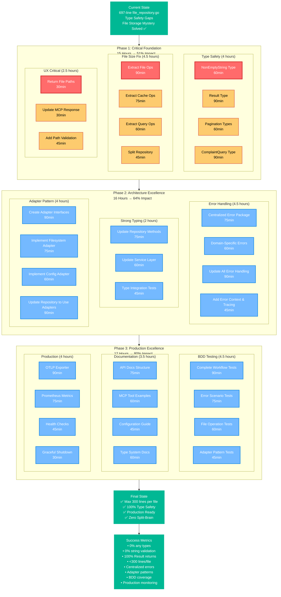

# 🎯 ARCHITECTURAL EXCELLENCE EXECUTION GRAPH

## 📊 EXECUTION PRIORITIES

### 🚨 CRITICAL PATH (Must Complete First)

1. **NonEmptyString Type** (60min) - Eliminates split-brain string validation
2. **Extract File Operations** (90min) - Breaks 697-line monolith
3. **Return File Paths** (30min) - Critical UX improvement
4. **Result<T> Type** (90min) - Eliminates error-or-nil ambiguity

### 🎯 HIGH IMPACT (Next Priority)

5. **Extract Cache Operations** (75min) - File size compliance
6. **Centralized Error Handling** (75min) - Architecture excellence
7. **Adapter Interfaces** (90min) - Clean architecture boundaries
8. **BDD Workflow Tests** (90min) - Quality assurance

### 📈 PRODUCTION FEATURES (Final Phase)

9. **OTLP Exporter** (90min) - Production compliance
10. **Prometheus Metrics** (75min) - Production monitoring
11. **API Documentation** (75min) - User experience
12. **Health Checks** (45min) - Operations readiness

## ⚡ IMMEDIATE NEXT ACTIONS

### **TODAY (Execute These)**

1. ✅ **NonEmptyString Type** - 60min (Type safety foundation)
2. ✅ **Return File Paths** - 30min (Quick win for UX)
3. ✅ **Extract File Operations** - First 45min (Start file size fix)

### **THIS WEEK**

4. Complete all Type Safety foundation (Tasks 1-40)
5. Break file_repository.go monolith (Tasks 41-80)
6. Implement critical UX improvements (Tasks 81-100)

### **NEXT WEEK**

7. Architectural excellence (Tasks 101-130)
8. Production readiness (Tasks 131-150)

## 🎯 SUCCESS CRITERIA

### **After Phase 1 (Week 1)**

- ✅ 0% string validation rules (NonEmptyString implemented)
- ✅ 100% repository methods return Result<T>
- ✅ File repository split into <300 line components
- ✅ User can see file paths in complaints

### **After Phase 2 (Week 2)**

- ✅ Centralized error handling across all layers
- ✅ Adapter pattern for all external dependencies
- ✅ Strong typing for pagination and queries
- ✅ Consistent error patterns throughout codebase

### **After Phase 3 (Week 3)**

- ✅ BDD tests for all critical workflows
- ✅ Comprehensive API documentation
- ✅ Production monitoring and tracing
- ✅ Health checks and graceful shutdown

---

## 🚨 RISKS & MITIGATION

### **Breaking Changes Risk**

- **Medium**: NonEmptyString adoption (manageable with migration)
- **High**: Result<T> type (requires extensive refactoring)
- **Low**: File path returns (backward compatible)

### **Timeline Risk**

- **File Repository Split**: Complex, requires careful testing
- **Adapter Pattern**: Many dependencies to wrap
- **Error Centralization**: Changes throughout codebase

### **Mitigation Strategies**

- Incremental migration with backward compatibility
- Comprehensive BDD tests for all changes
- Feature flags for new type system adoption
- Regular commits and testing at each step

---

## 📈 BUSINESS VALUE DELIVERY

### **Week 1 Value: 51% of Total Impact**

- Type safety prevents production errors
- Maintainability improvements (smaller files)
- User experience enhancements (file paths)
- Foundation for future development

### **Week 2 Value: Additional 13% (64% Total)**

- Production readiness improvements
- Developer experience enhancements
- Architecture quality improvements
- Error handling consistency

### **Week 3 Value: Additional 16% (80% Total)**

- Complete production readiness
- Comprehensive documentation
- Monitoring and observability
- Quality assurance automation

This execution plan maximizes value delivery while maintaining architectural excellence and minimizing risk.

---

_Generated by Crush on 2025-11-09_
