# 🎯 PARETO EXECUTION PLAN - Complaints-MCP

**Date:** 2025-11-17 11:43
**Approach:** 1% → 4% → 20% Pareto Analysis
**Standard:** Highest Possible Quality - Nothing Less Than Great!

---

## 📊 PARETO ANALYSIS RESULTS

### **1% EFFORT → 51% VALUE** (Critical Few - 5 hours)

These tasks eliminate the most critical architectural issues with minimal effort:

| Task                                           | Effort | Value | Why Critical                                                       |
| ---------------------------------------------- | ------ | ----- | ------------------------------------------------------------------ |
| **P1.1: Delete BaseRepository.go (dead code)** | 1h     | 15%   | Removes 168 lines of confusion, enables clean refactor             |
| **P1.2: Fix formatting (2 files)**             | 5min   | 1%    | Quick win, enables clean diffs                                     |
| **P1.3: Extract FilterStrategy pattern**       | 4h     | 35%   | Unlocks 60% duplication elimination, enables all other refactoring |

**Total:** 5 hours, **51% architectural improvement**

**Rationale:**

- BaseRepository deletion removes cognitive load and dead code
- FilterStrategy creates the FOUNDATION for eliminating 400+ lines of duplication
- These enable all subsequent refactoring

---

### **4% EFFORT → 64% VALUE** (High Impact - 16 hours)

Building on 1%, these deliver massive architectural gains:

| Task                                                    | Effort | Value | Cumulative |
| ------------------------------------------------------- | ------ | ----- | ---------- |
| **P2.1: Split file_repository.go using FilterStrategy** | 8h     | 20%   | 71%        |
| **P2.2: Create AgentName value object**                 | 4h     | 8%    | 79%        |
| **P2.3: Create SessionName value object**               | 2h     | 3%    | 82%        |
| **P2.4: Create ProjectName value object**               | 2h     | 3%    | 85%        |

**Total:** 16 hours (from start), **64% improvement**

**Rationale:**

- file_repository.go split eliminates file size violation and god object
- Value objects add compile-time type safety for domain layer
- These complete the architectural foundation

---

### **20% EFFORT → 80% VALUE** (Production Ready - 80 hours)

Complete Sprint 1 + Sprint 2 for production-grade architecture:

| Sprint                             | Tasks                            | Effort | Value | Cumulative |
| ---------------------------------- | -------------------------------- | ------ | ----- | ---------- |
| **Sprint 1: Critical Refactoring** | File splits, duplication removal | 40h    | 45%   | 96%        |
| **Sprint 2: Type Safety**          | All value objects, cleanup       | 40h    | 4%    | 100%       |

**Total:** 80 hours (4 weeks), **80% improvement**

**Remaining 20% effort (80 hours):** Polish, domain events, nice-to-haves

---

## 📋 COMPREHENSIVE 27-TASK PLAN (30-100min each)

### **PHASE 1: CRITICAL PATH (1% Tasks = 5 hours)**

| #      | Task                                 | Time   | Impact   | Priority | Dependencies |
| ------ | ------------------------------------ | ------ | -------- | -------- | ------------ |
| **C1** | Delete BaseRepository.go (dead code) | 60min  | CRITICAL | 1        | None         |
| **C2** | Fix formatting issues                | 5min   | LOW      | 2        | None         |
| **C3** | Extract FilterStrategy pattern       | 240min | CRITICAL | 3        | C1, C2       |

**Subtotal:** 305 min (5.1 hours)

---

### **PHASE 2: HIGH IMPACT (4% Tasks = 16 hours)**

| #      | Task                                      | Time   | Impact   | Priority | Dependencies |
| ------ | ----------------------------------------- | ------ | -------- | -------- | ------------ |
| **H1** | Split file_repository.go into 3 files     | 480min | CRITICAL | 4        | C3           |
| **H2** | Create internal/domain/agent_name.go      | 90min  | HIGH     | 5        | None         |
| **H3** | Create internal/domain/session_name.go    | 60min  | HIGH     | 6        | H2           |
| **H4** | Create internal/domain/project_name.go    | 60min  | HIGH     | 7        | H2           |
| **H5** | Update Complaint to use new value objects | 90min  | HIGH     | 8        | H2-H4        |
| **H6** | Update all tests for value objects        | 120min | HIGH     | 9        | H5           |

**Subtotal:** 900 min (15 hours)

**Cumulative (Phases 1-2):** 1205 min (20.1 hours) = **64% VALUE**

---

### **PHASE 3: PRODUCTION READY (20% Tasks)**

| #       | Task                                    | Time   | Impact | Priority | Dependencies |
| ------- | --------------------------------------- | ------ | ------ | -------- | ------------ |
| **M1**  | Split mcp_server.go into handler files  | 120min | HIGH   | 10       | None         |
| **M2**  | Consolidate/delete file_operations.go   | 90min  | MEDIUM | 11       | H1           |
| **M3**  | Extract constants for magic numbers     | 60min  | MEDIUM | 12       | None         |
| **M4**  | Improve repository naming               | 45min  | MEDIUM | 13       | H1           |
| **M5**  | Add Update() method to Complaint entity | 60min  | MEDIUM | 14       | H5           |
| **M6**  | Extract FileName() to Complaint domain  | 30min  | LOW    | 15       | None         |
| **M7**  | Split complaint_service_test.go         | 90min  | MEDIUM | 16       | None         |
| **M8**  | Split file_repository_test.go           | 60min  | MEDIUM | 17       | H1           |
| **M9**  | Add domain events (ComplaintFiled)      | 90min  | MEDIUM | 18       | H5           |
| **M10** | Add domain events (ComplaintResolved)   | 60min  | MEDIUM | 19       | M9           |
| **M11** | Create EventBus implementation          | 90min  | MEDIUM | 20       | M9           |
| **M12** | Add MCP schema validation constants     | 45min  | MEDIUM | 21       | H5           |
| **M13** | Replace DocsEnabled bool with enum      | 60min  | LOW    | 22       | None         |
| **M14** | Replace CacheEnabled bool with enum     | 60min  | LOW    | 23       | None         |
| **M15** | Replace AutoBackup bool with enum       | 60min  | LOW    | 24       | None         |

**Subtotal:** 1140 min (19 hours)

---

### **PHASE 4: EXCELLENCE & POLISH**

| #      | Task                                   | Time   | Impact | Priority | Dependencies |
| ------ | -------------------------------------- | ------ | ------ | -------- | ------------ |
| **P1** | Comprehensive integration testing      | 120min | HIGH   | 25       | All above    |
| **P2** | Update documentation (CLAUDE.md, etc.) | 90min  | MEDIUM | 26       | All above    |
| **P3** | Final code review and cleanup          | 60min  | MEDIUM | 27       | P1, P2       |

**Subtotal:** 270 min (4.5 hours)

---

## **TOTAL: 27 TASKS, 2915 MINUTES (48.6 HOURS)**

---

## 📊 TASK PRIORITIZATION MATRIX

### By Impact/Effort Ratio:

| Priority     | Tasks           | Impact | Effort | Ratio |
| ------------ | --------------- | ------ | ------ | ----- |
| **CRITICAL** | C1, C3, H1      | 70%    | 13h    | 5.4   |
| **HIGH**     | H2-H6, M1       | 20%    | 10h    | 2.0   |
| **MEDIUM**   | M2-M12          | 8%     | 14h    | 0.6   |
| **LOW**      | M6, M13-M15, P3 | 2%     | 4h     | 0.5   |

---

## 🎯 EXECUTION STRATEGY

### **Week 1: Critical Path (1% → 4%)**

**Days 1-2:** Execute C1-C3 (Phases 1)

- Delete dead code
- Create FilterStrategy
- **Milestone:** 51% value delivered

**Days 3-5:** Execute H1-H6 (Phase 2)

- Split files
- Add value objects
- **Milestone:** 64% value delivered

### **Week 2: Production Ready (20%)**

**Days 6-10:** Execute M1-M15 (Phase 3)

- Split MCP server
- Add domain events
- Replace boolean enums
- **Milestone:** 80% value delivered

### **Week 3: Polish & Excellence**

**Days 11-15:** Execute P1-P3 (Phase 4)

- Integration testing
- Documentation
- Final review
- **Milestone:** 100% complete

---

## 🔧 DETAILED TASK BREAKDOWN (100 TASKS @ 15min each)

### **C1: Delete BaseRepository.go (60min = 4 tasks × 15min)**

| ID   | Task                                    | Time  | Status  |
| ---- | --------------------------------------- | ----- | ------- |
| C1.1 | Verify BaseRepository has no usages     | 15min | Pending |
| C1.2 | Delete internal/repo/base_repository.go | 5min  | Pending |
| C1.3 | Remove imports/references               | 10min | Pending |
| C1.4 | Run tests to verify no breakage         | 30min | Pending |

---

### **C2: Fix Formatting (5min = 1 task)**

| ID   | Task                         | Time | Status  |
| ---- | ---------------------------- | ---- | ------- |
| C2.1 | Run gofmt -s -w on all files | 5min | Pending |

---

### **C3: Extract FilterStrategy (240min = 16 tasks × 15min)**

| ID    | Task                                       | Time  | Status  |
| ----- | ------------------------------------------ | ----- | ------- |
| C3.1  | Create internal/repo/filters.go            | 15min | Pending |
| C3.2  | Define FilterStrategy type                 | 15min | Pending |
| C3.3  | Implement severityFilter()                 | 15min | Pending |
| C3.4  | Implement projectFilter()                  | 15min | Pending |
| C3.5  | Implement unresolvedFilter()               | 15min | Pending |
| C3.6  | Implement searchFilter()                   | 15min | Pending |
| C3.7  | Create filterComplaints() helper           | 15min | Pending |
| C3.8  | Add tests for FilterStrategy               | 30min | Pending |
| C3.9  | Refactor CachedRepository.FindBySeverity() | 15min | Pending |
| C3.10 | Refactor FileRepository.FindBySeverity()   | 15min | Pending |
| C3.11 | Refactor CachedRepository.FindByProject()  | 15min | Pending |
| C3.12 | Refactor FileRepository.FindByProject()    | 15min | Pending |
| C3.13 | Refactor CachedRepository.FindUnresolved() | 15min | Pending |
| C3.14 | Refactor FileRepository.FindUnresolved()   | 15min | Pending |
| C3.15 | Run all tests                              | 15min | Pending |
| C3.16 | Commit FilterStrategy implementation       | 15min | Pending |

---

### **H1: Split file_repository.go (480min = 32 tasks × 15min)**

| ID    | Task                                           | Time  | Status  |
| ----- | ---------------------------------------------- | ----- | ------- |
| H1.1  | Create internal/repo/repository_cached.go      | 15min | Pending |
| H1.2  | Move CachedRepository struct                   | 15min | Pending |
| H1.3  | Move CachedRepository.Save()                   | 15min | Pending |
| H1.4  | Move CachedRepository.FindByID()               | 15min | Pending |
| H1.5  | Move CachedRepository.FindAll()                | 15min | Pending |
| H1.6  | Move CachedRepository.FindBySeverity()         | 15min | Pending |
| H1.7  | Move CachedRepository.Update()                 | 15min | Pending |
| H1.8  | Move CachedRepository.Delete()                 | 15min | Pending |
| H1.9  | Move CachedRepository.Search()                 | 15min | Pending |
| H1.10 | Move CachedRepository.FindByProject()          | 15min | Pending |
| H1.11 | Move CachedRepository.FindUnresolved()         | 15min | Pending |
| H1.12 | Move CachedRepository cache methods            | 15min | Pending |
| H1.13 | Create internal/repo/repository_file.go        | 15min | Pending |
| H1.14 | Move FileRepository struct                     | 15min | Pending |
| H1.15 | Move FileRepository.Save()                     | 15min | Pending |
| H1.16 | Move FileRepository.FindByID()                 | 15min | Pending |
| H1.17 | Move FileRepository.FindAll()                  | 15min | Pending |
| H1.18 | Move FileRepository.FindBySeverity()           | 15min | Pending |
| H1.19 | Move FileRepository.Update()                   | 15min | Pending |
| H1.20 | Move FileRepository.Delete()                   | 15min | Pending |
| H1.21 | Move FileRepository.Search()                   | 15min | Pending |
| H1.22 | Move FileRepository.FindByProject()            | 15min | Pending |
| H1.23 | Move FileRepository.FindUnresolved()           | 15min | Pending |
| H1.24 | Create internal/repo/repository_shared.go      | 15min | Pending |
| H1.25 | Move shared file I/O operations                | 30min | Pending |
| H1.26 | Move shared helper functions                   | 15min | Pending |
| H1.27 | Update file_repository.go with interfaces only | 15min | Pending |
| H1.28 | Fix imports in all repo files                  | 15min | Pending |
| H1.29 | Run tests                                      | 15min | Pending |
| H1.30 | Fix any test failures                          | 30min | Pending |
| H1.31 | Verify file sizes (all < 350 lines)            | 15min | Pending |
| H1.32 | Commit file split                              | 15min | Pending |

---

### **H2-H4: Create Value Objects (210min = 14 tasks × 15min)**

#### H2: AgentName (90min = 6 tasks)

| ID   | Task                                  | Time  | Status  |
| ---- | ------------------------------------- | ----- | ------- |
| H2.1 | Create internal/domain/agent_name.go  | 15min | Pending |
| H2.2 | Define AgentName type with validation | 30min | Pending |
| H2.3 | Add NewAgentName() constructor        | 15min | Pending |
| H2.4 | Add String(), IsEmpty() methods       | 15min | Pending |
| H2.5 | Add tests for AgentName               | 15min | Pending |
| H2.6 | Commit AgentName value object         | 5min  | Pending |

#### H3: SessionName (60min = 4 tasks)

| ID   | Task                                           | Time  | Status  |
| ---- | ---------------------------------------------- | ----- | ------- |
| H3.1 | Create internal/domain/session_name.go         | 15min | Pending |
| H3.2 | Define SessionName type (similar to AgentName) | 15min | Pending |
| H3.3 | Add tests for SessionName                      | 15min | Pending |
| H3.4 | Commit SessionName value object                | 5min  | Pending |

#### H4: ProjectName (60min = 4 tasks)

| ID   | Task                                           | Time  | Status  |
| ---- | ---------------------------------------------- | ----- | ------- |
| H4.1 | Create internal/domain/project_name.go         | 15min | Pending |
| H4.2 | Define ProjectName type (similar to AgentName) | 15min | Pending |
| H4.3 | Add tests for ProjectName                      | 15min | Pending |
| H4.4 | Commit ProjectName value object                | 5min  | Pending |

---

### **H5: Update Complaint Entity (90min = 6 tasks)**

| ID   | Task                                             | Time  | Status  |
| ---- | ------------------------------------------------ | ----- | ------- |
| H5.1 | Update Complaint.AgentName to AgentName type     | 15min | Pending |
| H5.2 | Update Complaint.SessionName to SessionName type | 15min | Pending |
| H5.3 | Update Complaint.ProjectName to ProjectName type | 15min | Pending |
| H5.4 | Update Complaint.ResolvedBy to AgentName type    | 15min | Pending |
| H5.5 | Update NewComplaint() constructor                | 15min | Pending |
| H5.6 | Fix compilation errors in domain layer           | 15min | Pending |

---

### **H6: Update Tests (120min = 8 tasks)**

| ID   | Task                            | Time  | Status  |
| ---- | ------------------------------- | ----- | ------- |
| H6.1 | Update domain/complaint_test.go | 30min | Pending |
| H6.2 | Update service tests            | 30min | Pending |
| H6.3 | Update repo tests               | 15min | Pending |
| H6.4 | Update MCP delivery tests       | 15min | Pending |
| H6.5 | Update BDD tests                | 30min | Pending |

---

### **REMAINING TASKS (M1-P3): 40 tasks**

[Similar 15min breakdown for each task M1-P3...]

---

## **GRAND TOTAL: 100 TASKS @ ~15min each = 25 hours**

(Note: Remaining 38 hours for testing, debugging, documentation)

---

## 🗺️ EXECUTION GRAPH

```mermaid
graph TD
    START[Start: Architectural Excellence] --> C1[C1: Delete BaseRepository<br/>60min]
    START --> C2[C2: Fix Formatting<br/>5min]

    C1 --> C3[C3: Extract FilterStrategy<br/>240min]
    C2 --> C3

    C3 --> H1[H1: Split file_repository.go<br/>480min]

    C3 --> H2[H2: Create AgentName<br/>90min]
    H2 --> H3[H3: Create SessionName<br/>60min]
    H2 --> H4[H4: Create ProjectName<br/>60min]

    H3 --> H5[H5: Update Complaint<br/>90min]
    H4 --> H5

    H5 --> H6[H6: Update Tests<br/>120min]

    H1 --> MILESTONE1[🎯 Milestone 1: 64% Value<br/>Repository Refactored]
    H6 --> MILESTONE1

    MILESTONE1 --> M1[M1: Split MCP Server<br/>120min]
    MILESTONE1 --> M2[M2: Consolidate file_operations<br/>90min]

    M1 --> M3[M3: Extract Constants<br/>60min]
    M2 --> M3

    M3 --> M4[M4: Improve Naming<br/>45min]
    M4 --> M5[M5: Add Update Method<br/>60min]

    M5 --> M9[M9: Domain Events<br/>240min]

    M9 --> MILESTONE2[🎯 Milestone 2: 80% Value<br/>Production Ready]

    MILESTONE2 --> P1[P1: Integration Tests<br/>120min]
    P1 --> P2[P2: Documentation<br/>90min]
    P2 --> P3[P3: Final Review<br/>60min]

    P3 --> SUCCESS[✅ SUCCESS<br/>100% Complete]

    style START fill:#e1f5e1
    style MILESTONE1 fill:#fff59d
    style MILESTONE2 fill:#fff59d
    style SUCCESS fill:#4caf50,color:#fff
    style C1 fill:#ff5252,color:#fff
    style C3 fill:#ff5252,color:#fff
    style H1 fill:#ff9800,color:#fff
```

---

## ✅ SUCCESS CRITERIA

### After Phase 1 (1% Effort):

- [ ] BaseRepository.go deleted (0 dead code)
- [ ] All files formatted
- [ ] FilterStrategy pattern implemented
- [ ] **51% architectural improvement achieved**

### After Phase 2 (4% Effort):

- [ ] file_repository.go split into 3 files (all < 350 lines)
- [ ] 3 value objects created and tested
- [ ] Complaint entity uses strong types
- [ ] **64% architectural improvement achieved**

### After Phase 3 (20% Effort):

- [ ] All files < 350 lines
- [ ] Code duplication < 5%
- [ ] Domain events implemented
- [ ] **80% architectural improvement achieved**

### Final (100% Effort):

- [ ] All 100 tasks complete
- [ ] All tests passing
- [ ] Documentation updated
- [ ] Code review approved
- [ ] **Architectural Excellence: Grade A (95/100)**

---

## 🚀 READY FOR EXECUTION

**Status:** PLAN COMPLETE
**Next Action:** Execute C1 (Delete BaseRepository)
**Estimated Completion:** 3 weeks for 80% value, 4 weeks for 100%

**Let's build something exceptional!** 🚀

---

_Prepared by: Senior Software Architect_
_Date: 2025-11-17 11:43_
_Standard: Highest Possible Quality_
_Approach: Pareto Principle (1% → 4% → 20%)_
