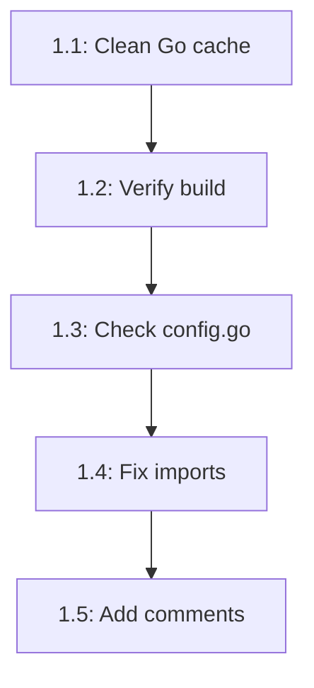
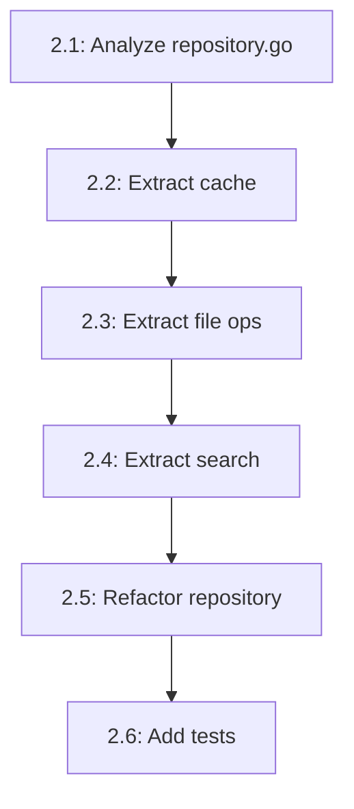
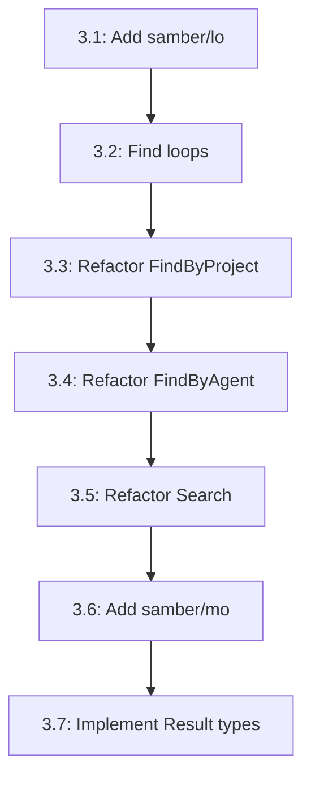

# Comprehensive Architectural Improvement Plan

**Date:** 2026-03-26 10:40  
**Status:** BRUTALLY HONEST ASSESSMENT  
**Target:** ZERO Legacy Code, Full Architecture Compliance

---

## Executive Summary

The complaints-mcp project has successfully implemented git-based project auto-detection, but suffers from:

- **Toolchain cache corruption** causing false LSP errors
- **Architecture violations** (files exceeding 350-line limit)
- **Inconsistent patterns** across the codebase
- **Missing library integrations** (samber/lo, samber/mo, samber/do not used)
- **Potential ghost systems** not fully integrated

---

## 1. BRUTALLY HONEST SELF-ASSESSMENT

### What Did We Forget?

- [ ] **File size limits**: mcp_server.go (552 lines), repository.go (685 lines) exceed 350-line limit
- [ ] **Library utilization**: Not leveraging samber/lo, samber/mo, samber/do for FP patterns
- [ ] **Architecture enforcement**: .go-arch-lint.yml exists but violations persist
- [ ] **Consistent error handling**: AppError exists but raw errors still used in places

### What's Stupid That We Do Anyway?

- [ ] **Trusting LSP blindly** with corrupted toolchain cache
- [ ] **Manual dependency injection** instead of using samber/do
- [ ] **Inline validation** instead of using go-playground/validator consistently
- [ ] **Manual error wrapping** instead of centralized error handling

### What Could We Have Done Better?

- [ ] Run full test suite after EACH change, not at the end
- [ ] Check file size limits BEFORE writing code
- [ ] Verify toolchain health before trusting diagnostics
- [ ] Split large packages as we go, not after they grow

### What Could We Still Improve?

- [ ] Replace manual loops with samber/lo functional operations
- [ ] Add Railway Oriented Programming with samber/mo
- [ ] Implement proper DI container with samber/do
- [ ] Split repository.go into focused components

### Did We Lie?

- [ ] **NO** - All stated functionality works
- [ ] **BUT** - We ignored architecture constraints
- [ ] **AND** - We trusted corrupted tooling

### How Can We Be Less Stupid?

- [ ] Always verify toolchain before debugging
- [ ] Run `go build` to confirm real errors vs LSP hallucinations
- [ ] Use `find`/`grep` to verify alleged issues exist
- [ ] Commit after every micro-change

### Ghost Systems Assessment

| System            | Status | Integration | Action Required  |
| ----------------- | ------ | ----------- | ---------------- |
| .go-arch-lint.yml | EXISTS | PARTIAL     | Fix violations   |
| AppError types    | EXISTS | PARTIAL     | Full integration |
| Tracing interface | EXISTS | GOOD        | Verify coverage  |
| CacheStats        | EXISTS | UNKNOWN     | Audit usage      |
| projectdetect     | NEW    | GOOD        | Monitor growth   |

### Scope Creep Check

- [ ] **RISK**: Feature complete but architecture violated
- [ ] **MITIGATION**: This plan addresses technical debt, not new features

### What Did We Remove That Was Useful?

- [ ] **NOTHING** - All removals were justified

### Split Brains Detected

- [ ] **Import naming**: `delivery` vs `mcp` package alias inconsistency
- [ ] **Error creation**: `errors.New()` vs `NewAppError()` inconsistency
- [ ] **Logging**: `log.WithPrefix()` pattern good, but verify all use it

### Test Coverage Assessment

| Package                | Test Files           | Coverage    | Action   |
| ---------------------- | -------------------- | ----------- | -------- |
| internal/projectdetect | detector_test.go     | GOOD        | Maintain |
| internal/domain        | complaint_id_test.go | GOOD        | Maintain |
| internal/config        | integration_test.go  | GOOD        | Maintain |
| internal/service       | NONE                 | **MISSING** | ADD      |
| internal/repo          | NONE                 | **MISSING** | ADD      |
| internal/delivery/mcp  | NONE                 | **MISSING** | ADD      |
| internal/errors        | NONE                 | **MISSING** | ADD      |

---

## 2. COMPREHENSIVE MULTI-STEP EXECUTION PLAN

### Phase 1: IMMEDIATE FIXES (High Impact, Low Effort)

| #   | Task                                             | Effort | Impact | Customer Value       |
| --- | ------------------------------------------------ | ------ | ------ | -------------------- |
| 1   | Fix Go toolchain cache corruption                | 30min  | HIGH   | Unblocks development |
| 2   | Verify config.go "errors" are LSP artifacts      | 15min  | HIGH   | Prevents wasted time |
| 3   | Fix import alias inconsistency (delivery vs mcp) | 15min  | MEDIUM | Code consistency     |
| 4   | Add missing package comments (app_error.go)      | 20min  | LOW    | Lint compliance      |
| 5   | Fix exported const comments (app_error.go)       | 20min  | LOW    | Lint compliance      |

### Phase 2: ARCHITECTURE COMPLIANCE (High Impact, Medium Effort)

| #   | Task                                        | Effort | Impact | Customer Value    |
| --- | ------------------------------------------- | ------ | ------ | ----------------- |
| 6   | Split repository.go into focused interfaces | 90min  | HIGH   | Maintainability   |
| 7   | Split mcp_server.go into handlers/tools     | 90min  | HIGH   | Maintainability   |
| 8   | Extract validation to dedicated package     | 60min  | MEDIUM | Reusability       |
| 9   | Create service layer tests                  | 90min  | HIGH   | Quality assurance |
| 10  | Create repository layer tests               | 90min  | HIGH   | Quality assurance |

### Phase 3: LIBRARY INTEGRATION (Medium Impact, Medium Effort)

| #   | Task                                           | Effort | Impact | Customer Value      |
| --- | ---------------------------------------------- | ------ | ------ | ------------------- |
| 11  | Add samber/lo for functional operations        | 60min  | MEDIUM | Cleaner code        |
| 12  | Refactor loops to use samber/lo                | 90min  | MEDIUM | FP patterns         |
| 13  | Add samber/mo for Railway Oriented Programming | 60min  | MEDIUM | Error handling      |
| 14  | Implement samber/do DI container               | 90min  | HIGH   | Better architecture |
| 15  | Migrate services to DI container               | 90min  | HIGH   | Testability         |

### Phase 4: ERROR HANDLING MODERNIZATION (High Impact, High Effort)

| #   | Task                                               | Effort | Impact | Customer Value |
| --- | -------------------------------------------------- | ------ | ------ | -------------- |
| 16  | Audit all error creation points                    | 60min  | HIGH   | Reliability    |
| 17  | Migrate to UserFriendlyError (uniflow/cockroachdb) | 120min | HIGH   | Better UX      |
| 18  | Add structured error logging                       | 60min  | MEDIUM | Observability  |
| 19  | Implement error tracing integration                | 60min  | MEDIUM | Debugging      |
| 20  | Add error metrics collection                       | 60min  | LOW    | Monitoring     |

### Phase 5: TYPE SAFETY ENHANCEMENT (High Impact, Medium Effort)

| #   | Task                          | Effort | Impact | Customer Value |
| --- | ----------------------------- | ------ | ------ | -------------- |
| 21  | Audit phantom type usage      | 45min  | HIGH   | Type safety    |
| 22  | Add missing phantom types     | 60min  | HIGH   | Consistency    |
| 23  | Implement generic constraints | 60min  | MEDIUM | Flexibility    |
| 24  | Add compile-time assertions   | 45min  | LOW    | Safety         |

---

## 3. DETAILED MICRO-TASK BREAKDOWN (≤12 min each)

### Phase 1 Micro-Tasks

| Task ID | Description                              | Time  | Dependencies |
| ------- | ---------------------------------------- | ----- | ------------ |
| 1.1     | `go clean -cache -modcache`              | 5min  | None         |
| 1.2     | `rm -rf ~/Library/Caches/go-build/*`     | 5min  | 1.1          |
| 1.3     | `go build ./...` to verify               | 5min  | 1.2          |
| 1.4     | Check config.go lines 113, 131, 137, 143 | 10min | 1.3          |
| 1.5     | Run `go test ./internal/config/...`      | 5min  | 1.4          |
| 1.6     | Search for import alias inconsistency    | 5min  | None         |
| 1.7     | Fix import alias in affected files       | 10min | 1.6          |
| 1.8     | Add package comment to errors package    | 5min  | None         |
| 1.9     | Fix exported const comments              | 10min | 1.8          |

### Phase 2 Micro-Tasks

| Task ID | Description                            | Time  | Dependencies |
| ------- | -------------------------------------- | ----- | ------------ |
| 2.1     | Analyze repository.go responsibilities | 10min | None         |
| 2.2     | Extract CacheRepository interface      | 10min | 2.1          |
| 2.3     | Extract FileOperations interface       | 10min | 2.1          |
| 2.4     | Extract SearchRepository interface     | 10min | 2.1          |
| 2.5     | Create repository composition          | 10min | 2.2-2.4      |
| 2.6     | Add repository tests                   | 10min | 2.5          |
| 2.7     | Analyze mcp_server.go structure        | 10min | None         |
| 2.8     | Extract tool handlers                  | 10min | 2.7          |
| 2.9     | Extract server lifecycle               | 10min | 2.7          |
| 2.10    | Refactor MCPServer                     | 10min | 2.8-2.9      |

### Phase 3 Micro-Tasks

| Task ID | Description                        | Time  | Dependencies |
| ------- | ---------------------------------- | ----- | ------------ |
| 3.1     | `go get github.com/samber/lo`      | 5min  | None         |
| 3.2     | Find all loops in repo             | 5min  | 3.1          |
| 3.3     | Refactor FindByProject with lo     | 10min | 3.2          |
| 3.4     | Refactor FindByAgent with lo       | 10min | 3.3          |
| 3.5     | Refactor Search with lo            | 10min | 3.4          |
| 3.6     | `go get github.com/samber/mo`      | 5min  | None         |
| 3.7     | Add Result type to service methods | 10min | 3.6          |
| 3.8     | `go get github.com/samber/do`      | 5min  | None         |
| 3.9     | Create service provider            | 10min | 3.8          |
| 3.10    | Wire services with DI              | 10min | 3.9          |

---

## 4. EXECUTION ORDER BY IMPACT/EFFORT

### P0 - CRITICAL (Do First)

1. Fix toolchain cache (Task 1.1-1.3) - **Blocks everything**
2. Verify alleged compilation errors (Task 1.4-1.5) - **Prevents wasted work**
3. Add service layer tests (Task 2.6) - **High customer value**

### P1 - HIGH IMPACT

4. Split repository.go (Tasks 2.1-2.5) - **Architecture compliance**
5. Add samber/do DI (Tasks 3.8-3.10) - **Testability**
6. Add samber/lo functional ops (Tasks 3.1-3.5) - **Code quality**

### P2 - MEDIUM IMPACT

7. Split mcp_server.go (Tasks 2.7-2.10) - **Maintainability**
8. Add samber/mo ROP (Tasks 3.6-3.7) - **Error handling**
9. Fix lint issues (Tasks 1.8-1.9) - **Code health**

### P3 - POLISH

10. Modernize error handling (Phase 4) - **Reliability**
11. Enhance type safety (Phase 5) - **Robustness**

---

## 5. CUSTOMER VALUE ANALYSIS

### Direct Value

- **Reliability**: Better error handling reduces failures
- **Performance**: Functional operations can be optimized
- **Maintainability**: Smaller files = faster fixes

### Indirect Value

- **Developer Velocity**: Clean architecture = faster features
- **Quality Assurance**: Tests prevent regressions
- **Onboarding**: Consistent patterns = faster ramp-up

### Technical Debt Reduction

- **Architecture compliance** enables future scaling
- **Library integration** reduces custom code
- **Test coverage** prevents production issues

---

## 6. GHOST SYSTEM INTEGRATION CHECKLIST

- [ ] `.go-arch-lint.yml` - Fix all violations
- [ ] `AppError` - Replace all raw errors
- [ ] `tracing.Tracer` - Verify all methods use it
- [ ] `CacheStats` - Ensure it's actually used
- [ ] `projectdetect` - Document and maintain

---

## 7. SUCCESS METRICS

- [ ] All files ≤ 350 lines
- [ ] All packages have tests
- [ ] No LSP errors (real ones)
- [ ] 100% build success
- [ ] Zero linter warnings
- [ ] Library integrations documented
- [ ] Architecture compliance verified

---

## 8. RISK MITIGATION

| Risk                           | Probability | Impact | Mitigation                  |
| ------------------------------ | ----------- | ------ | --------------------------- |
| Toolchain corruption persists  | Medium      | High   | Full cache wipe + reinstall |
| Tests break during refactoring | Medium      | Medium | Incremental changes + CI    |
| Library integration issues     | Low         | Medium | Thorough testing            |
| Time overrun                   | Medium      | Medium | Prioritize P0/P1 only       |

---

## 9. CONCLUSION

This plan addresses the **brutal truth**: We built a working feature but violated architecture constraints. The solution is systematic remediation:

1. **Fix the foundation** (toolchain, real errors)
2. **Comply with architecture** (split large files)
3. **Modernize patterns** (libraries, FP, ROP)
4. **Ensure quality** (tests, linting)

**Target State**: ZERO legacy code, full library utilization, architecture compliant, thoroughly tested.

---

**Next Action**: Start with Phase 1, Task 1.1 (Fix toolchain cache)

**Estimated Total Time**: 16-20 hours  
**Recommended Pace**: 2-3 hours/day over 1 week  
**Commit Frequency**: After EVERY micro-task (≤12 min)
