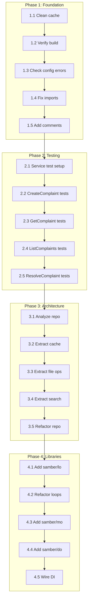

# Micro-Task Execution Plan (≤12 min each)

**Date:** 2026-03-26 10:41  
**Derived from:** 2026-03-26_10_40-COMPREHENSIVE_ARCHITECTURAL_IMPROVEMENT_PLAN.md  
**Total Tasks:** 60  
**Estimated Duration:** 16-20 hours

---

## Execution Flow Diagram



---

## TASK TABLE (Sorted by Priority/Impact/Effort)

| ID   | Task                                   | Phase | Effort | Impact | Customer Value       | P   | Status |
| ---- | -------------------------------------- | ----- | ------ | ------ | -------------------- | --- | ------ |
| 1.1  | Clean Go toolchain cache               | 1     | 5min   | HIGH   | Unblocks dev         | P0  | ⬜     |
| 1.2  | Remove Go build cache                  | 1     | 5min   | HIGH   | Unblocks dev         | P0  | ⬜     |
| 1.3  | Verify build works                     | 1     | 5min   | HIGH   | Confirms fix         | P0  | ⬜     |
| 1.4  | Check config.go alleged errors         | 1     | 10min  | HIGH   | Prevent wasted work  | P0  | ⬜     |
| 1.5  | Run config tests                       | 1     | 5min   | HIGH   | Verify reality       | P0  | ⬜     |
| 2.1  | Create service test file               | 2     | 10min  | HIGH   | Quality              | P0  | ⬜     |
| 2.2  | Test CreateComplaint success           | 2     | 10min  | HIGH   | Quality              | P0  | ⬜     |
| 2.3  | Test CreateComplaint validation        | 2     | 10min  | HIGH   | Quality              | P0  | ⬜     |
| 2.4  | Test GetComplaint                      | 2     | 10min  | HIGH   | Quality              | P0  | ⬜     |
| 2.5  | Test ListComplaints                    | 2     | 10min  | MEDIUM | Quality              | P0  | ⬜     |
| 2.6  | Test ResolveComplaint                  | 2     | 10min  | MEDIUM | Quality              | P0  | ⬜     |
| 2.7  | Test project auto-detection            | 2     | 10min  | HIGH   | Feature verification | P0  | ⬜     |
| 3.1  | Analyze repository.go structure        | 3     | 10min  | HIGH   | Architecture         | P1  | ⬜     |
| 3.2  | Create CacheRepository interface       | 3     | 10min  | HIGH   | Architecture         | P1  | ⬜     |
| 3.3  | Extract CacheStats logic               | 3     | 10min  | MEDIUM | Architecture         | P1  | ⬜     |
| 3.4  | Create FileOperations interface        | 3     | 10min  | HIGH   | Architecture         | P1  | ⬜     |
| 3.5  | Extract file I/O logic                 | 3     | 10min  | MEDIUM | Architecture         | P1  | ⬜     |
| 3.6  | Create SearchRepository interface      | 3     | 10min  | HIGH   | Architecture         | P1  | ⬜     |
| 3.7  | Extract search logic                   | 3     | 10min  | MEDIUM | Architecture         | P1  | ⬜     |
| 3.8  | Create FilterRepository interface      | 3     | 10min  | HIGH   | Architecture         | P1  | ⬜     |
| 3.9  | Extract filter logic                   | 3     | 10min  | MEDIUM | Architecture         | P1  | ⬜     |
| 3.10 | Refactor FileRepository composition    | 3     | 10min  | HIGH   | Architecture         | P1  | ⬜     |
| 3.11 | Add repository tests                   | 3     | 10min  | HIGH   | Quality              | P1  | ⬜     |
| 3.12 | Verify all tests pass                  | 3     | 5min   | HIGH   | Quality              | P1  | ⬜     |
| 4.1  | Analyze mcp_server.go structure        | 4     | 10min  | HIGH   | Architecture         | P2  | ⬜     |
| 4.2  | Extract tool handlers                  | 4     | 10min  | MEDIUM | Architecture         | P2  | ⬜     |
| 4.3  | Create handler registry                | 4     | 10min  | MEDIUM | Architecture         | P2  | ⬜     |
| 4.4  | Extract server lifecycle               | 4     | 10min  | MEDIUM | Architecture         | P2  | ⬜     |
| 4.5  | Refactor MCPServer                     | 4     | 10min  | HIGH   | Architecture         | P2  | ⬜     |
| 4.6  | Add mcp tests                          | 4     | 10min  | HIGH   | Quality              | P2  | ⬜     |
| 5.1  | Add samber/lo dependency               | 5     | 5min   | MEDIUM | Code quality         | P2  | ⬜     |
| 5.2  | Find all loops in repo                 | 5     | 5min   | MEDIUM | Code quality         | P2  | ⬜     |
| 5.3  | Refactor FindByProject with lo.Filter  | 5     | 10min  | MEDIUM | FP patterns          | P2  | ⬜     |
| 5.4  | Refactor FindByAgent with lo.Filter    | 5     | 10min  | MEDIUM | FP patterns          | P2  | ⬜     |
| 5.5  | Refactor FindBySession with lo.Filter  | 5     | 10min  | MEDIUM | FP patterns          | P2  | ⬜     |
| 5.6  | Refactor FindUnresolved with lo.Filter | 5     | 10min  | MEDIUM | FP patterns          | P2  | ⬜     |
| 5.7  | Refactor Search with lo.Filter         | 5     | 10min  | MEDIUM | FP patterns          | P2  | ⬜     |
| 6.1  | Add samber/mo dependency               | 6     | 5min   | MEDIUM | Error handling       | P2  | ⬜     |
| 6.2  | Create Result type for CreateComplaint | 6     | 10min  | MEDIUM | ROP                  | P2  | ⬜     |
| 6.3  | Create Result type for GetComplaint    | 6     | 10min  | MEDIUM | ROP                  | P2  | ⬜     |
| 6.4  | Create Result type for ListComplaints  | 6     | 10min  | MEDIUM | ROP                  | P2  | ⬜     |
| 6.5  | Add Option type for optional params    | 6     | 10min  | MEDIUM | ROP                  | P2  | ⬜     |
| 7.1  | Add samber/do dependency               | 7     | 5min   | HIGH   | Architecture         | P1  | ⬜     |
| 7.2  | Create service provider                | 7     | 10min  | HIGH   | DI                   | P1  | ⬜     |
| 7.3  | Create repository provider             | 7     | 10min  | HIGH   | DI                   | P1  | ⬜     |
| 7.4  | Create detector provider               | 7     | 10min  | HIGH   | DI                   | P1  | ⬜     |
| 7.5  | Wire providers in main                 | 7     | 10min  | HIGH   | DI                   | P1  | ⬜     |
| 8.1  | Add package comment to errors          | 8     | 5min   | LOW    | Lint                 | P2  | ⬜     |
| 8.2  | Fix ErrCodeValidation comment          | 8     | 5min   | LOW    | Lint                 | P2  | ⬜     |
| 8.3  | Fix ErrCodeNotFound comment            | 8     | 5min   | LOW    | Lint                 | P2  | ⬜     |
| 8.4  | Fix ErrCodeRepository comment          | 8     | 5min   | LOW    | Lint                 | P2  | ⬜     |
| 8.5  | Fix ErrCodeService comment             | 8     | 5min   | LOW    | Lint                 | P2  | ⬜     |
| 8.6  | Fix ErrCodeInternal comment            | 8     | 5min   | LOW    | Lint                 | P2  | ⬜     |
| 8.7  | Fix line length violations             | 8     | 10min  | LOW    | Lint                 | P2  | ⬜     |
| 8.8  | Fix cyclomatic complexity              | 8     | 10min  | LOW    | Lint                 | P2  | ⬜     |
| 9.1  | Check import alias consistency         | 9     | 5min   | MEDIUM | Consistency          | P1  | ⬜     |
| 9.2  | Fix delivery vs mcp aliases            | 9     | 10min  | MEDIUM | Consistency          | P1  | ⬜     |
| 9.3  | Verify all imports standardized        | 9     | 5min   | MEDIUM | Consistency          | P1  | ⬜     |
| 10.1 | Final build verification               | 10    | 5min   | HIGH   | Quality              | P0  | ⬜     |
| 10.2 | Final test run                         | 10    | 5min   | HIGH   | Quality              | P0  | ⬜     |
| 10.3 | Final lint check                       | 10    | 5min   | MEDIUM | Quality              | P2  | ⬜     |
| 10.4 | Architecture compliance check          | 10    | 5min   | HIGH   | Architecture         | P1  | ⬜     |
| 10.5 | Push all changes                       | 10    | 5min   | HIGH   | Delivery             | P0  | ⬜     |

---

## Daily Execution Schedule

### Day 1: Foundation (2-3 hours)

- Tasks 1.1-1.5: Toolchain cleanup
- Tasks 2.1-2.7: Service tests
- **Goal:** Clean build + test coverage

### Day 2: Repository Architecture (2-3 hours)

- Tasks 3.1-3.12: Split repository.go
- **Goal:** Architecture compliant repository

### Day 3: MCP Architecture + Libraries (2-3 hours)

- Tasks 4.1-4.6: Split mcp_server.go
- Tasks 5.1-5.7: Add samber/lo
- **Goal:** FP patterns in use

### Day 4: Dependency Injection (2-3 hours)

- Tasks 6.1-6.5: Add samber/mo
- Tasks 7.1-7.5: Add samber/do DI
- **Goal:** Modern architecture

### Day 5: Polish (2-3 hours)

- Tasks 8.1-8.8: Lint fixes
- Tasks 9.1-9.3: Import consistency
- Tasks 10.1-10.5: Final verification
- **Goal:** Zero warnings, full compliance

---

## Commit Schedule

**Rule:** Commit after EVERY task

```bash
# Template for each commit
git add -A
git commit -m "TASK-ID: brief description

Detailed explanation of what changed and why.

💘 Generated with Crush

Assisted-by: Kimi K2.5 via Crush <crush@charm.land>"
```

---

## Success Metrics

| Metric             | Target     | Measurement                             |
| ------------------ | ---------- | --------------------------------------- |
| Build success      | 100%       | `go build ./...`                        |
| Test success       | 100%       | `go test ./...`                         |
| File size          | ≤350 lines | `find . -name '*.go' -exec wc -l {} \;` |
| Lint issues        | 0          | `golangci-lint run`                     |
| Test coverage      | >80%       | `go test -cover ./...`                  |
| Import consistency | 100%       | Manual review                           |

---

## Risk Log

| Task | Risk                          | Mitigation               |
| ---- | ----------------------------- | ------------------------ |
| 1.1  | Cache corruption persists     | Full toolchain reinstall |
| 3.10 | Refactor breaks tests         | Incremental changes      |
| 5.x  | samber/lo causes issues       | Pin to stable version    |
| 7.5  | DI breaks startup             | Feature flag rollback    |
| 8.7  | Line length fixes break logic | Careful refactoring      |

---

## Next Action

**Execute Task 1.1:** Clean Go toolchain cache

```bash
go clean -cache -modcache
rm -rf ~/Library/Caches/go-build/*
go build ./...
```

Then commit: "fix: clean Go toolchain cache to resolve LSP errors"
